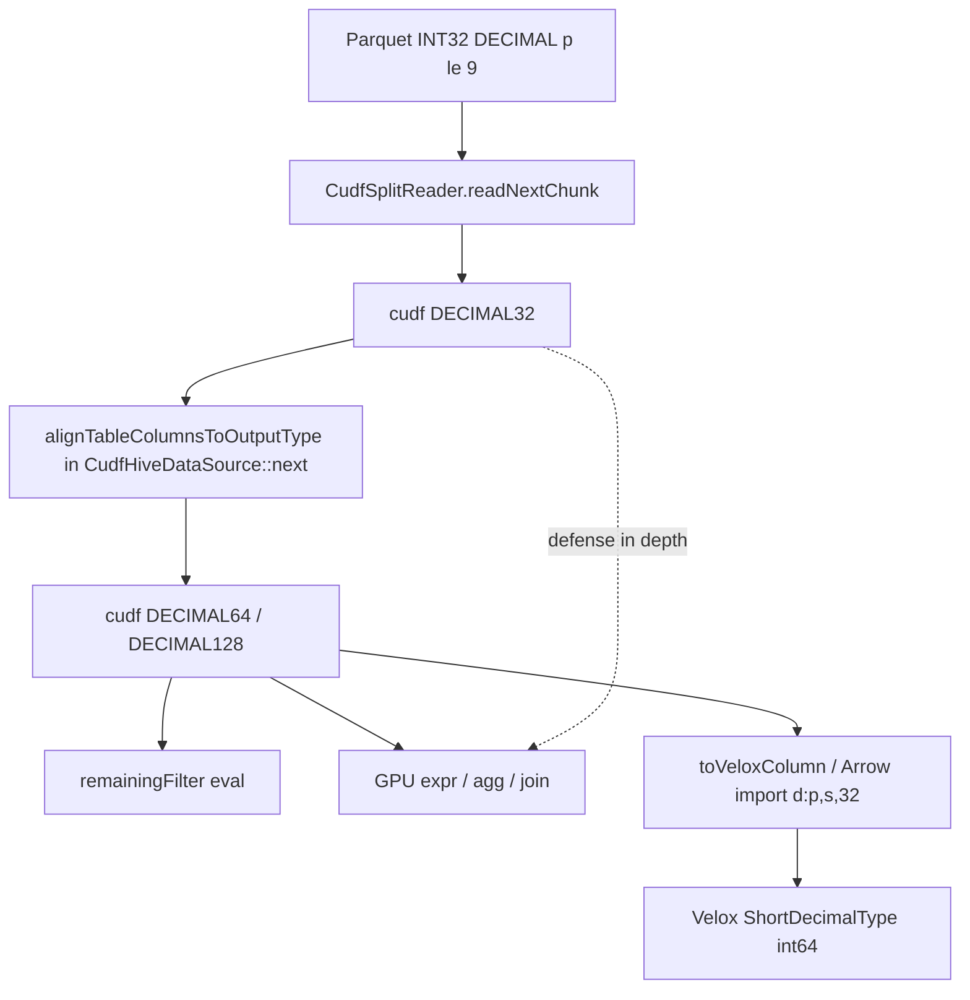

# DECIMAL32-to-DECIMAL64 Widening Plan

**Status: COMPLETE** (phases 1–5 implemented on branch `simoneves/support_presto_decimal32`)

| Phase | Commit | Summary |
|-------|--------|---------|
| 1/5 | `65a6525d2` | Shared widening helpers + agg input defense |
| 2/5 | `e77a98c64` | Scan-boundary alignment in `CudfHiveDataSource::next` |
| 3/5 | `f4a4ab056` | Arrow bridge `d:p,s,32` import + tests |
| 4/5 | `cb866d623` | Expression evaluator / divide kernel defense |
| 5/5 | `f34da3ed5` | Unit, interop, scan, and expression tests |

---

## Problem (original)

cuDF's Parquet reader can materialize small-precision decimals as native `cudf::type_id::DECIMAL32` (physical INT32, precision 1–9). The Velox+CUDF stack assumes short Velox decimals map to **`DECIMAL64`** via [`veloxToCudfDataType`](velox/experimental/cudf/exec/VeloxCudfInterop.cpp) and did not handle `DECIMAL32` in compute paths.

**Gap (resolved):** Parquet `DECIMAL(7,2)` (e.g. [`decimal_dict.parquet`](velox/dwio/parquet/tests/examples/decimal_dict.parquet)) read through `CudfSplitReader` could arrive as `DECIMAL32`, then flow into remaining filters, GPU expressions, aggregations, or `toVeloxColumn` (Arrow bridge) without widening — causing failures or silent incompatibility.



Velox CPU Parquet already widens INT32 → `int64` at read time ([`PageReader.cpp`](velox/dwio/parquet/reader/PageReader.cpp) ~477–485). This plan closed the equivalent gap on the **CUDF + Arrow bridge** side.

---

## Design principles

1. **Widen once, early:** Align column storage width immediately after Parquet chunk read and **before** `remainingFilter` evaluation in [`CudfHiveDataSource::next`](velox/experimental/cudf/connectors/hive/CudfHiveDataSource.cpp) (~228–250).
2. **Mirror existing patterns:** Follow [`castDecimal64InputToDecimal128`](velox/experimental/cudf/exec/DecimalAggregationHostOps.cpp) — thin wrapper around `cudf::cast` preserving `numeric::scale_type`.
3. **Target type from Velox schema:** Use `veloxToCudfDataType(outputType->childAt(i))` as the authoritative expected cuDF type (`DECIMAL64` for short decimal, `DECIMAL128` for long).
4. **Minimal surface area:** A single shared alignment helper at scan boundary; secondary defense at aggregation inputs, Arrow import, and expression evaluation.
5. **No Velox type change:** Velox continues to represent short decimals as `int64` (`ShortDecimalType`). No new `DECIMAL32` in Velox.

---

## Implementation phases

### Phase 1 — Shared widening utilities (foundation) ✅

**Commit:** `65a6525d2`

**Files:**
- [`velox/experimental/cudf/exec/DecimalAggregationHostOps.h`](velox/experimental/cudf/exec/DecimalAggregationHostOps.h)
- [`velox/experimental/cudf/exec/DecimalAggregationHostOps.cpp`](velox/experimental/cudf/exec/DecimalAggregationHostOps.cpp)
- [`velox/experimental/cudf/exec/CudfGroupby.cpp`](velox/experimental/cudf/exec/CudfGroupby.cpp)
- [`velox/experimental/cudf/exec/CudfReduce.cpp`](velox/experimental/cudf/exec/CudfReduce.cpp)
- [`velox/experimental/cudf/exec/CudfWindow.cpp`](velox/experimental/cudf/exec/CudfWindow.cpp)

**Implemented:**
- `castDecimal32InputToDecimal64`, `castDecimalColumnIfNeeded`, `alignTableColumnsToOutputType`
- Chained `castDecimal32InputToDecimal64` before `castDecimal64InputToDecimal128` in decimal SUM paths (groupby, reduce, window)

**Deferred (unchanged from v1):** Nested LIST/STRUCT decimal alignment in `alignTableColumnsToOutputType` — not needed for flat Parquet scan columns.

---

### Phase 2 — Scan boundary (primary fix) ✅

**Commit:** `e77a98c64`

**File:** [`velox/experimental/cudf/connectors/hive/CudfHiveDataSource.cpp`](velox/experimental/cudf/connectors/hive/CudfHiveDataSource.cpp)

**Implemented in `next()` (~236–237):**

```
chunkOpt = readNextChunk()
cudfTable = move(chunkOpt)
cudfTable = alignTableColumnsToOutputType(
    move(cudfTable), getTableRowType(), stream, get_output_mr())  // before filter
if (remainingFilterExprSet_) { ... }
```

**Note:** Uses `getTableRowType()` (not `outputType_`) so filter-only columns in `readColumnNames_` are widened too. Iceberg and equality-delete paths inherit this `next()` flow.

---

### Phase 3 — Arrow bridge import (Velox fallback path) ✅

**Commit:** `f4a4ab056`

**File:** [`velox/vector/arrow/Bridge.cpp`](velox/vector/arrow/Bridge.cpp)

**Implemented:**
- `parseDecimalFormat` accepts `bitWidth == 32` → `ShortDecimalType`
- Short-decimal array import for `bitWidth == 32` via `createShortDecimalVectorFromInt32Decimals` (int32 sign-extension to int64)
- Tests in [`ArrowBridgeSchemaTest.cpp`](velox/vector/arrow/tests/ArrowBridgeSchemaTest.cpp) (`d:7,2,32`, `d:9,1,32`) and [`ArrowBridgeArrayTest.cpp`](velox/vector/arrow/tests/ArrowBridgeArrayTest.cpp)

**Export unchanged:** Velox short decimals still export as `d:p,s,64` with `useDecimalTypeWidth=true`.

---

### Phase 4 — Expression / kernel defense (secondary) ✅

**Commit:** `cb866d623`

**Files:**
- [`velox/experimental/cudf/expression/ExpressionEvaluator.cpp`](velox/experimental/cudf/expression/ExpressionEvaluator.cpp)
- [`velox/experimental/cudf/expression/DecimalExpressionKernels.cpp`](velox/experimental/cudf/expression/DecimalExpressionKernels.cpp)

**Implemented (beyond the original “simpler alternative” sketch):**

| Area | Change |
|------|--------|
| Scalar helpers | `decimalScalarIsZero`, `hasDecimalZero`, `castDecimalScalar` — `DECIMAL32` via `numeric::decimal32` |
| Divide prep | New `prepareDecimalDivideColumn` — chains `castDecimal32InputToDecimal64`, then `DECIMAL64→DECIMAL128` when output requires it; scalar operands aligned to widened column type |
| MUL | `!= DECIMAL128` promotion (covers `DECIMAL32` + `DECIMAL64`); DECIMAL64-output MUL casts operands to result type |
| Kernels | `getDecimalScalarValue` reads `DECIMAL32`; `checkDecimalDivideTypes` rejects unwidened `DECIMAL32` with explicit message |

**Unchanged (as planned):**
- [`AstUtils.h`](velox/experimental/cudf/expression/AstUtils.h) — already emits `DECIMAL64` for short-decimal literals
- [`DecimalExpressionKernelsGpu.cu`](velox/experimental/cudf/expression/DecimalExpressionKernelsGpu.cu) — no int32 divide dispatch; inputs widened upstream
- ADD/SUB/MOD/CMP — already used `cudf::cast` when operand types differ

---

### Phase 5 — Tests ✅

**Commit:** `f34da3ed5`

| Item | Status | Location |
|------|--------|----------|
| 5a. Widening helper unit tests | ✅ | [`DecimalWideningTest.cpp`](velox/experimental/cudf/tests/DecimalWideningTest.cpp) — target `velox_cudf_decimal_widening_test` |
| 5b. Interop round-trip | ✅ | [`InteropTest.cpp`](velox/experimental/cudf/tests/InteropTest.cpp) — `DECIMAL(5,2)`, `DECIMAL(9,2)`, nulls, DECIMAL32 widen → Velox |
| 5c. Parquet e2e scan | ✅ | [`TableScanTest.cpp`](velox/experimental/cudf/tests/TableScanTest.cpp) — `decimalDictParquetInt32Physical` reads `decimal_dict.parquet` |
| 5d. Low-precision expressions | ✅ | [`DecimalExpressionTest.cpp`](velox/experimental/cudf/tests/DecimalExpressionTest.cpp) — `DECIMAL(7,2)` and `DECIMAL(9,2)` arithmetic |
| 5e. Arrow bridge 32-bit | ✅ | Phase 3 (`ArrowBridgeSchemaTest`, `ArrowBridgeArrayTest`) |

**Not implemented (optional in original plan):**
- [`decimal.parquet`](velox/dwio/parquet/tests/examples/decimal.parquet) `DECIMAL(5,2)` e2e scan
- Low-precision decimal **aggregation** tests (expression tests only; agg paths covered indirectly via Phase 1 wiring)
- Re-enabling `DISABLED_decimalFilterPushdown` / `DISABLED_decimalStatsFilterIoPruning` in TableScanTest

---

## File change summary

| Priority | File | Action | Status |
|----------|------|--------|--------|
| P0 | `DecimalAggregationHostOps.h/.cpp` | Widening + table alignment helpers | ✅ |
| P0 | `CudfHiveDataSource.cpp` | `alignTableColumnsToOutputType` after read, before filter | ✅ |
| P1 | `Bridge.cpp` | Accept/import `bitWidth=32` | ✅ |
| P1 | `CudfGroupby.cpp`, `CudfReduce.cpp`, `CudfWindow.cpp` | Chain 32→64 before 64→128 | ✅ |
| P2 | `ExpressionEvaluator.cpp`, `DecimalExpressionKernels.cpp` | DECIMAL32 operand defense | ✅ |
| P2 | Test files listed above | New coverage | ✅ |

**No changes needed (confirmed):**
- [`veloxToCudfDataType`](velox/experimental/cudf/exec/VeloxCudfInterop.cpp) — maps short decimal → `DECIMAL64`
- Velox CPU Parquet reader — widens INT32 → int64
- [`toCudfTable`](velox/experimental/cudf/exec/VeloxCudfInterop.cpp) export — emits 64-bit width
- [`AstUtils.h`](velox/experimental/cudf/expression/AstUtils.h) — short-decimal literals already `DECIMAL64`

---

## Risks and validation

| Risk | Mitigation / status |
|------|---------------------|
| `cudf::cast(DECIMAL32, DECIMAL64)` unsupported | `DecimalWideningTest` and `InteropTest` gate on `cudf::is_supported_cast` |
| Scale sign convention (Velox +, cuDF −) | Widening preserves `inputCol.type().scale()` unchanged |
| Filter pushdown with DECIMAL32 predicates | **Still open** — `DISABLED_decimalFilterPushdown` remains disabled pending cuDF fix |
| Performance (one cast per decimal column per chunk) | Accepted; preferable to per-operator casts |

---

## Actual commit breakdown (branch `simoneves/support_presto_decimal32`)

One commit per phase (5 total), suitable for a single PR or cherry-pick review:

1. `65a6525d2` — helpers + agg defense
2. `e77a98c64` — scan boundary
3. `f4a4ab056` — Arrow bridge
4. `cb866d623` — expression defense
5. `f34da3ed5` — tests

---

## Implementation todos

- [x] Add `castDecimal32InputToDecimal64`, `castDecimalColumnIfNeeded`, and `alignTableColumnsToOutputType` in `DecimalAggregationHostOps.h/.cpp`
- [x] Call `alignTableColumnsToOutputType` in `CudfHiveDataSource::next()` after `readNextChunk`, before remainingFilter eval (use `getTableRowType` for filter columns)
- [x] Extend `Bridge.cpp` `parseDecimalFormat` and short-decimal import for `bitWidth=32` with int32 sign-extension
- [x] Chain DECIMAL32 widening before `castDecimal64InputToDecimal128` in `CudfGroupby`, `CudfReduce`, `CudfWindow`
- [x] Pre-cast DECIMAL32 operands in `ExpressionEvaluator` binary/divide/multiply paths
- [x] Add `DecimalWideningTest`, `InteropTest` decimal cases, `TableScanTest` with `decimal_dict.parquet`, ArrowBridge 32-bit import tests (phase 3)
