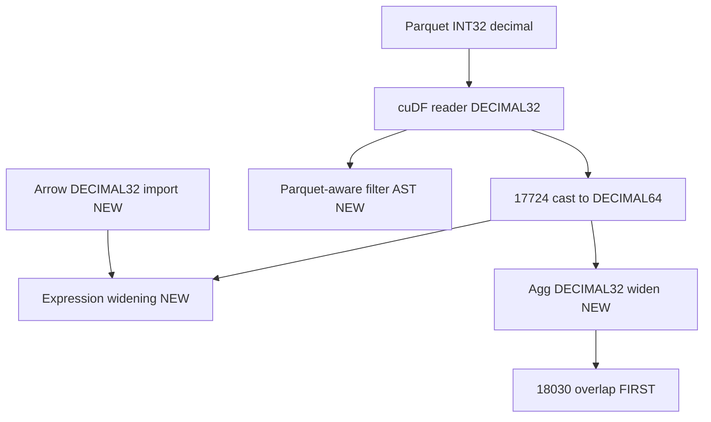

# Sift remaining simpler_decimal32 changes onto main

## Overview

Port remaining `simpler_decimal32` work onto existing branch
`simoneves/remaining_decimal32_changes` (already at main tip). Keep PR 17724
casting. Six commits: Commit 1 is isolated 18030-overlap deserialize
strengthening; then Arrow import, agg widening, expression widening, Parquet
filter AST, and TableScan tests.

## Context

- Stale branch: `simoneves/simpler_decimal32` (12 commits, merge-base `5219caf`,
  ~82 commits behind `main`)
- Already on main:
  - [PR 17724](https://github.com/facebookincubator/velox/pull/17724)
    (`3fc56b453`): `castDecimalColumnsToVeloxTypes` in
    `velox/experimental/cudf/connectors/hive/CudfSplitReader.cpp`
  - [PR 18030](https://github.com/facebookincubator/velox/pull/18030)
    (`85e7016cd`): compact-null payload accept + null-mask unpack in decimal SUM
    state
- **Chosen strategy:** keep 17724 casting; do **not** remove it; port
  complementary remaining fixes only

## Branch setup

Already done: working branch is `simoneves/remaining_decimal32_changes` at main
tip `b7b5831ba`.

Port by theme as discrete commits below — not a wholesale rebase of the
12-commit `simpler_decimal32` stack (that stack deletes 17724 casting and
conflicts badly).

## Proposed commit sequence

Commit 1 is first because it overlaps PR 18030 and must stay reviewable on its
own. Later commits do not depend on it.

### Commit 1 — Strengthen decimal SUM state deserialize atop 18030 — SKIPPED

**Decision (2026-07-27):** Skip. PR 18030 already accepts compact null payloads
and passes the null mask into unpack. Branch `f5dddf347` offset-based host
validation does not strengthen that fix (and dropping the null-mask path would
regress 18030). Branch round-trip test is covered by 18030’s compact-null suite.

---

### Commit 2 — Arrow DECIMAL32 import

**Source:** `0587db538`, `a1d4b56c8`

**Scope:**

- `velox/vector/arrow/Bridge.cpp`: allow bitWidth 32 in `parseDecimalFormat`;
  add `createShortDecimalVectorFrom32BitDecimals()`
- `velox/vector/arrow/tests/ArrowBridgeArrayTest.cpp` /
  `ArrowBridgeSchemaTest.cpp`: DECIMAL32 import tests + TIME import fix
- **Exclude** any `exportValidityBitmap` hunk that would undo main PR 18243

**Suggested title:** `fix(arrow): Import Arrow DECIMAL32 into ShortDecimalType`

**Validate:** Arrow bridge schema/array tests for decimal + TIME

---

### Commit 3 — DECIMAL32 aggregation input widening

**Source:** `a1bee94a3`

**Scope:**

- `velox/experimental/cudf/exec/DecimalAggregationHostOps.cpp` / `.h`:
  `DECIMAL32→DECIMAL64→DECIMAL128` in `castDecimal64InputToDecimal128`;
  `widenDecimalSumForSerialization()`
- `velox/experimental/cudf/exec/CudfGroupby.cpp`: comment-only if needed;
  **keep** main’s empty-group AVG null fix (PR 18026)
- Test: `decimalSerializeSumStateDecimal32`

**Suggested title:** `fix(cudf): Widen DECIMAL32 for GPU decimal SUM aggregation`

**Validate:** `DecimalAggregationTest` serialize/widen cases

**Note:** Deliberately separate from Commit 1 so 18030-overlap review stays
clean.

---

### Commit 4 — Expression DECIMAL32/64 operand widening

**Source:** `7e59a7cb3`, `b9d14cbb8` (expression/kernel hunks only; defer
TableScan filter integration tests to Commits 5–6)

**Scope:**

- `velox/experimental/cudf/expression/ExpressionEvaluator.cpp`:
  `decimalTypeRank`, `widerDecimalTypeId`, `commonDecimalOperandType`,
  `alignDecimalColumnOperands`, `castDecimalScalarIfNeeded`,
  `decimalComparison`, Switch/Coalesce widening, `castDecimalScalar` DECIMAL32
  support
- `velox/experimental/cudf/expression/DecimalExpressionKernels.cpp`: DECIMAL32
  scalar reads
- **Keep** main’s `checkAllTrue()` if present
- Unit-level / existing evaluator coverage where available;
  `decimal32IfWithLiteral` can land here if it does not need Parquet filter
  plumbing

**Suggested title:** `fix(cudf): Align DECIMAL32/DECIMAL64 operands in expressions`

**Validate:** relevant cudf expression / TableScan IF/CASE tests that do not
require the new filter AST

---

### Commit 5 — Parquet-aware deferred subfield / bloom filter AST

**Source:** `1b161d58c`, `16db1f5a9`, `3172cc1df`, `7c37934b5`, compile fixes
from `951a9c706` for these APIs

Largest unique piece; orthogonal to 17724 (filters see Parquet physical types;
17724 only casts the returned table).

**Scope:**

- New `velox/experimental/cudf/expression/ParquetSchemaUtils.h`
- `velox/experimental/cudf/expression/AstUtils.h`:
  `decimalStorageTypeAndScale` and related helpers — **preserve**
  `constantVarcharValue`
- `velox/experimental/cudf/expression/SubfieldFiltersToAst.cpp/.h`: optional
  `ParquetColumnTypeMap*`
- `velox/experimental/cudf/connectors/hive/CudfSplitReader.cpp/.h`:
  `SubfieldFilterBuildState`, `buildSubfieldFilterAst()` — **keep**
  `castDecimalColumnsToVeloxTypes` call sites
- `velox/experimental/cudf/connectors/hive/CudfHiveDataSource.cpp/.h`:
  `makeSubfieldFilterBuildState()`
- Iceberg: `CudfIcebergDataSource.cpp`, `CudfIcebergSplitReader.cpp/.h`
  `hasSubfieldFilters()` wiring
- `velox/experimental/cudf/tests/SubfieldFilterAstTest.cpp`: Parquet-schema /
  DECIMAL32 literal cases

**Suggested title:** `fix(cudf): Align decimal subfield filters with Parquet schema`

**Validate:** `SubfieldFilterAstTest`; smoke TableScan with subfield filters

---

### Commit 6 — TableScan / filter integration tests

**Source:** `59523dbe5`, remaining `TableScanTest.cpp` from `7e59a7cb3` /
`b9d14cbb8` / `1b161d58c`, adapted for 17724 casting

**Scope:**

- `velox/experimental/cudf/tests/TableScanTest.cpp`: `decimal32SubfieldFilter`,
  `decimal32FilterWithMultiply`, and any IF/CASE scan tests not already in
  Commit 4
- Adapt tests that assumed no scan cast / cuDF-native DECIMAL32 writers so they
  pass with 17724 casting still enabled
- **Retain** main’s 17724 nested/low-precision scan round-trips

**Suggested title:** `test(cudf): Cover DECIMAL32 filter and expression scan paths`

**Validate:** `TableScanTest` decimal cases (17724 suite + new cases)

---

## Explicitly do NOT port

- Removal of `castDecimalColumnsToVeloxTypes` / anonymous cast helpers
- `Bridge.cpp` `exportValidityBitmap` regression vs PR 18243
- Removal of `constantVarcharValue` or `checkAllTrue`
- Replacement of 18030’s null-mask unpack with branch-only offset validation
- Blind rebase of the whole 12-commit stack onto main
- Folding Commit 1 (18030 overlap) into aggregation widening or any later commit

## Validation (overall)

- Prefer validating after each commit above
- Full pass before PR: Arrow bridge decimal/TIME; `DecimalAggregationTest`;
  `SubfieldFilterAstTest`; `TableScanTest` decimal cases
- Spot-check a decimal query path that uses subfield/bloom filters if available
  locally

## Expected conflict hotspots

- `velox/experimental/cudf/connectors/hive/CudfSplitReader.cpp` — highest
  (Commit 5): merge filter deferral onto 17724 cast path
- `velox/experimental/cudf/exec/DecimalAggregationState.cpp` — Commit 1:
  additive merge onto 18030
- `velox/experimental/cudf/expression/AstUtils.h` /
  `ExpressionEvaluator.cpp` — Commits 4–5
- `velox/experimental/cudf/tests/TableScanTest.cpp` /
  `DecimalAggregationTest.cpp` — Commits 1, 3, 6
