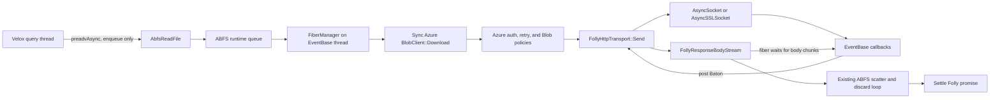

# ABFS native `preadvAsync` over a fiber-backed Azure transport

Status: implementation specification

Target: the current Velox `main` branch. `ReadFile` already exposes
`hasPreadvAsync()` and `preadvAsync()`, so native ABFS async reads compile and
function independently of any downstream reader change.

## Decision

Add a native `AbfsReadFile::preadvAsync` that runs the synchronous Azure Blob
SDK call stack on Folly fibers. Inject a custom
`Azure::Core::Http::HttpTransport` into a second, async-only Blob client. The
transport uses `folly::EventBase`, `folly::AsyncSocket`, and
`folly::AsyncSSLSocket`; its synchronous `Send` method and response
`BodyStream::OnRead` wait on `folly::fibers::Baton`. Those waits suspend only
the current fiber while the EventBase thread continues to run other fibers and
socket callbacks.

The implementation is completion-driven even when EventBase uses epoll. That
is the first correctness checkpoint, not the final performance scope. The
production end state has a Linux backend built on Folly `IoUringBackend`,
`AsyncIoUringSocket`, and Fizz when the pinned versions compose correctly. The
HTTP codec and Azure fiber bridge must be independent of the socket/TLS engine
so the reference EventBase backend and optimized io_uring backend exercise the
same semantics and tests.

Do not claim io_uring socket I/O merely because EventBase uses an
`IoUringBackend`: ordinary `AsyncSocket` may still use readiness polling.
Before selecting the optimized backend, a syscall trace must show actual
io_uring connect/send/receive completion and a benchmark must show that it is
at least as fast as the EventBase reference. The final implementation prefers
the fastest validated backend in `auto` mode and retains the reference backend
as a correct fallback.

Keep a separate client using the Azure SDK's default transport for disabled
mode and synchronous metadata operations. Async disabled must have the same
code path and behavior as today. After the fiber path passes production parity,
enabled synchronous data reads delegate to the same async core and wait on the
external caller thread.

The custom transport still owns substantial generic HTTP work: asynchronous
DNS integration, TLS setup, HTTP/1.1 framing, connection pooling, timeouts,
proxy support, and response streaming. It does not reimplement Azure request
signing, bearer policy, SAS URL handling, service API versions, Blob response
models, or storage error parsing.

## Grounded baseline

The relevant repository behavior is:

- `velox/common/file/File.h` already defines `hasPreadvAsync()` and
  `preadvAsync()`.
- A downstream reader can call native `preadvAsync` directly when
  `hasPreadvAsync()` is true. That consumer integration is deferred; a Velox
  IO executor is not required by the `ReadFile` contract itself.
- `AbfsReadFile.cpp` currently maps one vectored read to one contiguous Blob
  range request, including null-buffer gaps, and drains gaps through a bounded
  discard buffer.
- `AzureClientProviderImpl.cpp` constructs Blob clients without
  `BlobClientOptions`, so all reads currently use the SDK default transport.
- Velox pins Azure Storage Data Lake 12.8.0 and Folly v2026.01.05.00.
- Azure 12.8.0 supports
  `BlobClientOptions.Transport.Transport = shared_ptr<HttpTransport>`.
- Azure `HttpTransport::Send` and `BodyStream::OnRead` are synchronous virtual
  interfaces. This is exactly the boundary adapted by fibers.
- Folly v2026.01.05.00 has EventBase-integrated `FiberManager`, fiber `Baton`,
  `AsyncSocket`, and `AsyncSSLSocket`.
- Velox has no reusable HTTP client in the ABFS adapter and does not directly
  depend on Proxygen. Use a maintained parser, not an ad hoc HTTP parser.

## Goals

1. Return a pending `folly::SemiFuture<uint64_t>` without running the Azure
   request on the calling query thread.
2. Allow many Blob range reads to remain in flight with a fixed, small number
   of ABFS runtime threads.
3. Keep the Azure SDK's synchronous public API and its request construction,
   Shared Key signing, SAS handling, bearer policy, Blob response parsing, and
   storage exception behavior.
4. Preserve current ABFS scatter and null-gap semantics: one contiguous HTTP
   range and a successful result equal to the sum of all input range lengths.
5. Stream response bodies through bounded buffers. Do not buffer a full 4 MiB
   natural read per request inside the transport.
6. Preserve safety when `AbfsReadFile` is destroyed while requests are active.
7. Make resource limits and instrumentation sufficient to prove that
   concurrency is independent of Velox IO executor size.

## Non-goals

- Do not dispatch the existing blocking Azure call to a larger thread pool and
  call that native async.
- Do not bypass the Azure SDK to construct or sign Blob REST requests.
- Do not modify downstream reader scheduling or prefetch budgets as part of
  this standalone ABFS change.
- Do not make async ABFS the default in the first landing.
- Do not add async writes.
- Do not couple the Azure adapter or HTTP codec API to io_uring. A normal
  EventBase backend is the reference implementation; a measured io_uring
  backend is part of the production end goal.
- Do not hand-write TLS or a general-purpose HTTP parser.

## Required contract

`AbfsReadFile` may return `hasPreadvAsync() == true` only when all of the
following hold:

1. Async ABFS was explicitly enabled.
2. The ABFS runtime initialized successfully.
3. The selected authentication provider produced an async-only Blob client
   configured with the fiber transport.
4. Retry delay cannot block an ABFS runtime thread.
5. The selected auth path cannot acquire an ordinary contended mutex while a
   fiber holding that mutex is suspended on network I/O.

For each accepted call:

- Copy the vector of ranges and `FileIoContext`; caller memory remains owned by
  the caller and must stay valid until the future settles.
- Settle the promise exactly once with the logical byte count or an exception.
- Do not touch destination memory after settlement.
- A zero-logical-length request may complete immediately with zero.
- Non-zero requests, including all-null ranges, keep the current one-range
  behavior in the first implementation. Optimizing all-null reads is a
  separate behavioral change.
- Dropping the returned future does not cancel the request. The current
  `ReadFile` API has no cancellation token.

## Architecture



  ### End-state transport layers

  Keep these ownership boundaries from the first prototype so later performance
  work replaces a layer instead of forking the ABFS implementation:

  1. `AbfsReadFile` owns Blob range and scatter semantics only.
  2. `AbfsAsyncRuntime` owns admission, sharding, fibers, timers, and runtime
    lifetime.
  3. `FollyHttpTransport` adapts Azure's synchronous `HttpTransport` and
    `BodyStream` contracts to a fiber. It does not know which socket backend is
    selected.
  4. `HttpConnection` is the protocol-neutral request and streaming-response
    contract consumed by the Azure transport.
  5. `Http1Connection` owns Boost.Beast parsing, serialization, framing, and
    connection reuse. It consumes a generic Folly `AsyncTransportWrapper`.
  6. `AsyncChannelFactory` creates a connected plaintext or TLS
    `AsyncTransportWrapper` for an endpoint.
  7. `EventSocketChannelFactory` uses `AsyncSocket` and `AsyncSSLSocket` and is
    the portable reference backend.
  8. `IoUringChannelFactory` uses `AsyncIoUringSocket` and, if its compatibility
    checkpoint passes, `fizz::client::AsyncFizzClient`. Fizz accepts a generic
    `AsyncTransportWrapper`, which is the clean boundary for composing TLS over
    an io_uring socket.

  No backend conditional belongs in `AbfsReadFile`, Azure client providers, the
  HTTP codec, or response scatter code. Backend selection occurs once when the
  runtime builds its channel factory.

  Fizz is already a pinned Velox dependency when Parquet is enabled, but the
  ABFS target does not currently link it. The io_uring stage must verify target
  availability for every supported ABFS build configuration and add an explicit
  dependency or a feature guard. Do not accidentally make all ABFS builds depend
  on Fizz when the optimized backend was not compiled.

### Runtime ownership

`AbfsFileSystem` owns a shared `AbfsAsyncRuntime` when async reads are enabled
and passes it to each `AbfsReadFile`. In-flight request state retains the
runtime, so destroying the filesystem or file cannot invalidate callbacks.

The runtime owns:

- A configurable small number of `folly::ScopedEventBaseThread` instances.
- One EventBase-integrated `folly::fibers::FiberManager` per runtime thread,
  obtained through `folly::fibers::getFiberManager(eventBase)`.
- One event-loop-affine HTTP connection pool per endpoint.
- A small bounded DNS resolver and endpoint cache. DNS may initially use a
  dedicated bounded resolver executor because it occurs per endpoint, not per
  range read. It must never run `getaddrinfo` on an EventBase thread.
- Admission queues and metrics.

The runtime owns shared `RuntimeState`; clients and transports hold
`shared_ptr<RuntimeState>`, while `RuntimeState` never points to an
`AbfsReadFile::Impl`. The runtime queue retains `AsyncReadRequest` only until
terminal completion. `AsyncReadRequest` retains `Impl`, and `Impl` retains the
runtime and both clients. This directed ownership graph has no cycle and keeps
the fiber client alive through the final callback.

Assign a file or endpoint consistently to a runtime shard. A socket and its
callbacks never migrate between EventBase threads.

Do not create an unbounded fiber for every queued request. Admit at most
`maxActiveRequests` fibers; retain excess submissions as heap request state in
a bounded queue. This bounds stack memory as:

$$
M_{fiber} \leq N_{active} \times S_{stack}
$$

Start with a 256 KiB fiber stack only as a conservative prototype setting.
Measure high-water stack use and lower it if safe. The value is not an API.

### Synchronous compatibility and fiber clients

Each `AbfsReadFile::Impl` has:

- `syncFileClient_`: current Azure Blob client using the SDK default transport.
- `fiberFileClient_`: optional Azure Blob client configured with the shared
  `FollyHttpTransport`; it is invoked only from an ABFS runtime fiber.

During transport development, use `syncFileClient_` for initialization and the
existing synchronous APIs and use `fiberFileClient_` only from
`preadvAsync`. Do not inject the fiber transport into the synchronous client.

After the fiber path passes retry, authentication, proxy, error, and
performance parity, make the async core the single enabled-mode read
implementation:

- When async is disabled, `pread`, `preadv`, and initialization continue to use
  `syncFileClient_` exactly as today.
- When async is enabled, `preadv` calls the same internal async submission used
  by `preadvAsync` and waits for its future on the external caller thread.
  `pread` wraps its destination as one range and follows the same path.
- Never perform that blocking wait on an ABFS EventBase thread. Add a runtime
  thread assertion so an accidental reentrant synchronous call fails instead
  of deadlocking the event loop.
- Keep `syncFileClient_` for disabled mode and synchronous metadata operations
  until metadata receives its own fiber adapter.

This unifies Blob range, scatter, retry, and error behavior, and lets legacy
production callers use the new transport. It does not make a synchronous API
nonblocking: each synchronous caller still occupies its calling thread until
the future completes. A legacy executor that dispatches 32 synchronous
`preadv` calls still parks 32 executor threads. The full scaling benefit comes
when a caller observes `hasPreadvAsync() == true` and keeps multiple futures
outstanding, with no Velox IO executor involved.

The word "vectored" does not itself imply multiple concurrent storage
requests. In the current ABFS implementation:

- `preadv(offset, buffers)` accepts multiple destination ranges and null gaps,
  but maps their complete logical span to one contiguous Blob HTTP range. It
  performs one network request and needs one caller thread in the synchronous
  path.
- `preadv(regions, iobufs)` accepts independent file regions, but currently
  loops over them sequentially on one caller thread.
- A downstream reader can create storage concurrency above these methods by
  producing multiple coalesced groups and submitting one `preadvAsync` future
  per group. That consumer is deferred integration context, not a prerequisite
  for this standalone PR.

Therefore, changing one synchronous `preadv` to call `preadvAsync` and wait
does not by itself reduce parked caller threads: one call parked one thread
before and still parks one thread afterward. It moves the Azure network stack
onto the shared fiber runtime and unifies implementations. Thread-count scaling
improves only when the caller keeps multiple futures outstanding without
waiting per call. A future async API for a batch of independent regions could
submit all regions on fibers and expose one aggregate future, but that is not
the current `ReadFile::preadvAsync` contract and is outside this change.

### Async submission

The public method should be structurally equivalent to:

```cpp
folly::SemiFuture<uint64_t> AbfsReadFile::preadvAsync(
    uint64_t offset,
    const std::vector<folly::Range<char*>>& buffers,
    const FileIoContext& context) const {
  auto [promise, future] = folly::makePromiseContract<uint64_t>();
  auto request = std::make_shared<AsyncReadRequest>(
      impl_, offset, buffers, context, std::move(promise));
  impl_->asyncRuntime()->enqueue(std::move(request));
  return std::move(future);
}
```

The runtime later starts a fiber that calls the normal synchronous
`fiberFileClient_->download(options)` and drains its returned `BodyStream` using
the same scatter/discard algorithm as synchronous `preadvInternal`.

Never capture a raw `this`. `AsyncReadRequest` retains
`shared_ptr<AbfsReadFile::Impl>` until terminal completion.

### Provider changes

Do not silently configure registered third-party providers with a transport
they did not request. Extend `AzureClientProvider` with a distinctly named,
source-compatible optional method for an async read client:

```cpp
virtual std::unique_ptr<AzureBlobClient> getReadFileClientWithOptions(
    const std::shared_ptr<AbfsPath>& path,
    const config::ConfigBase& config,
    const Azure::Storage::Blobs::BlobClientOptions& options) {
  return nullptr;
}
```

Keep the existing pure virtual method unchanged. The different name avoids
overload hiding and makes custom-provider opt-in explicit. Built-in providers
override the new method and pass `options` into every Blob client constructor.

Add a factory operation with exact behavior:

```cpp
struct AzureReadClients {
  std::unique_ptr<AzureBlobClient> sync;
  std::unique_ptr<AzureBlobClient> fiber;
  std::string asyncUnsupportedReason;
};

static AzureReadClients getReadFileClients(
    const std::shared_ptr<AbfsPath>& path,
    const config::ConfigBase& config,
    const Azure::Storage::Blobs::BlobClientOptions* fiberOptions);
```

`getReadFileClients` invokes the registered provider factory once, always
builds `sync` through the existing method, and builds `fiber` through the new
method only when `fiberOptions` is non-null. This preserves provider-local
state across construction of the pair. If a provider cannot support the fiber
path, it returns null and a stable reason.

`AbfsFileSystem` parses `fs.azure.async-read.enabled` once. When false it does
not create a runtime and passes no fiber options. When true it creates the
runtime and passes it to `AbfsReadFile`. `AbfsReadFile::Impl` calls
`getReadFileClients`; if the runtime is non-null and `fiber` is null, its
constructor throws a user-facing error containing account, provider or auth
mode, and `asyncUnsupportedReason`. This is the only unsupported-provider
fallback decision. `hasPreadvAsync()` returns true only when both runtime and
fiber client are present.

The dynamic SAS provider must retain the options and apply them every time it
recreates an expiring Blob client.

### Transport behavior

Implement `FollyHttpTransport` as an
`Azure::Core::Http::HttpTransport`. `Send` is legal only on an ABFS runtime
fiber. It performs these steps:

1. Validate the Azure `Context` and translate the request method, absolute URL,
   headers, and optional request body without changing signed header values.
2. Acquire an event-loop-affine connection using a fiber-aware waiter.
3. Connect through `folly::AsyncSocket`, or `folly::AsyncSSLSocket` for HTTPS.
4. Write the request asynchronously.
5. Suspend on a fiber Baton until a complete response status line and headers
   are parsed, an error occurs, or a timer expires.
6. Build `Azure::Core::Http::RawResponse`, preserving HTTP version, status,
   reason, and response headers.
7. For a buffered Azure request, consume the decoded body into
   `RawResponse::SetBody` subject to a hard body limit.
8. For a streaming request, attach `FollyResponseBodyStream` with
   `RawResponse::SetBodyStream` and return after headers.

Convert connect, TLS, write, parse, timeout, and premature EOF failures to
`Azure::Core::Http::TransportException`. This lets Azure policies observe
transport failures at the same boundary as the default adapter.

Callbacks are `noexcept`: capture callback failures into transaction state and
post the Baton. Baton posting before the fiber begins waiting must be safe.

### HTTP implementation

Use Boost.Beast's incremental HTTP/1.1 parser and serializer over Folly's
asynchronous transport. Boost is already a Velox dependency. Confirm the exact
CMake target in the Phase 0 build spike and add only the narrow dependency
needed by `velox_abfs`.

Do not parse HTTP with delimiter searches in production code. The parser must
handle at least:

- GET and HEAD for Blob reads and properties.
- POST request bodies before OAuth is enabled.
- Content-Length and chunked response framing.
- Informational responses.
- Fragmented status lines, headers, and chunk boundaries.
- Connection-close-delimited error bodies.
- Configurable maximum status/header size and buffered body size.
- Keep-alive and `Connection: close` semantics.

Use HTTP/1.1 with no pipelining in the initial implementation. One connection
has at most one active response. Concurrency comes from multiple pooled
connections. HTTP/2 is a later transport optimization and does not change the
fiber or `ReadFile` contract.

### TLS implementation

Use `folly::AsyncSSLSocket`, not a custom OpenSSL state machine. At minimum:

- TLS 1.2 or newer.
- SNI set to the request host.
- System trust roots loaded through OpenSSL.
- Certificate chain verification enabled.
- Hostname verification enabled for the request host.
- No production option that silently disables verification.
- TLS session reuse where supported by the connection pool.

`SSLContext` defaults are not secure enough by themselves. Explicitly enable
peer and peer-name verification. Add a test where a trusted certificate for the
wrong hostname is rejected.

### Streaming response body

`FollyResponseBodyStream::OnRead` is synchronous to Azure but fiber-aware:

1. Return already-decoded bytes immediately if available.
2. If the message is complete, return zero.
3. Otherwise arm an asynchronous socket read and an EventBase timer, wait on a
   fiber Baton, then resume parsing.
4. Throw a transport exception on timeout, parser error, socket error, or early
   EOF.

The stream owns the HTTP transaction and connection lease. Return the
connection to the pool only after the complete framed body has been consumed
and the response permits reuse. Destroying a body stream before EOF closes the
connection; it must not return a connection containing unread response bytes.

Keep decoded ingress buffering bounded, initially 64 KiB per active response.
`AbfsReadFile` continues to use its existing bounded 256 KiB discard buffer for
null ranges. Do not allocate temporary storage equal to a null gap or full Blob
range.

## SDK blocking hazards and landing gates

The transport alone is not enough. The pinned Azure SDK has blocking code
above the transport.

### Retry delay

Azure Core 12.8.0 `RetryPolicy::Send` calls
`std::this_thread::sleep_for(retryAfter)`. If used unchanged on an EventBase
thread, one throttled request stalls every fiber on that runtime shard.

Preferred resolution:

1. Contribute a backward-compatible delay callback to Azure Core
   `RetryOptions`. The default callback keeps `sleep_for`; Velox supplies a
   callback implemented with a fiber Baton and EventBase timer.
2. Upgrade Velox's Azure SDK pin to a release containing that hook.
3. Keep Azure's retry classification, request reset, Retry-After handling,
   jitter, and attempt accounting unchanged.

Acceptable fallback only with maintainer approval: set the built-in retry count
to zero and add a Velox policy that mirrors Azure's retry algorithm but uses a
fiber timer. This duplicates SDK behavior and is therefore less desirable.

For a Phase 0 prototype, retries may be disabled to validate transport
concurrency. That prototype must not be presented as production-ready and must
not be the final Velox landing. Never strip Retry-After headers or set delays to
zero to evade the blocking sleep.

### OAuth token acquisition

Azure Core's bearer policy holds `std::mutex` while calling
`TokenCredential::GetToken`. Azure Identity's token cache holds
`std::shared_timed_mutex` while the token HTTP request runs. If that request
yields a fiber, another fiber contending on either ordinary mutex can block the
EventBase thread and prevent the owner from resuming.

Do not enable native async OAuth until one of these is implemented and stress
tested:

- Preferred: an Azure SDK change that permits fiber-aware synchronization in
  bearer and token-cache single-flight paths.
- Velox-contained alternative: lease one Blob client pipeline per active OAuth
  request so bearer-policy mutexes are never contended, and pass those clients
  a shared `FiberTokenCredential`. The wrapper uses a fiber-aware single-flight
  cache and permits only one call at a time into the underlying
  `ClientSecretCredential`; token HTTP uses the fiber transport. No ordinary
  mutex may be held by one fiber while another fiber on the same EventBase can
  contend for it.

Warm-token tests are insufficient. Force expiration while many reads are in
flight and prove progress on a one-thread runtime.

Until the OAuth checkpoint passes, the built-in OAuth provider's
`getReadFileClientWithOptions` returns null with reason
`OAuth async token refresh is not fiber-safe`. This makes the gate executable
instead of advisory. After the checkpoint, that method returns the client-lane
pool adapter described above.

### Dynamic SAS providers

`SasTokenProvider::getSasToken` is an arbitrary synchronous callback. It may
block independently of the Azure transport. Either add an async-capability
contract for registered token providers or run refresh on a small bounded auth
executor and let the requesting fiber wait. The latter can consume a thread
during infrequent refresh, but never one thread per Blob read.

The compatibility implementation is owned by `AbfsAsyncRuntime`: one auth
executor thread by default, configurable up to two, and one refresh
single-flight per account, filesystem, path, and operation key. The fiber
waits on a Baton posted by the auth task. Locks protect only cache-state
transitions and are never held while the callback or fiber wait runs. The
preferred end-state provider API adds an optional async token method; providers
implementing it do not use the auth executor.

### Proxy parity

Specifying a custom transport causes Azure Core transport options to be
ignored. The custom transport must eventually implement HTTP proxy and HTTPS
CONNECT behavior, proxy authentication required by current deployments, and
custom CA behavior. Until then, async mode stays opt-in and must reject a
configuration that requires unsupported proxy behavior.

Perform that rejection in `AbfsAsyncRuntime::create`, before any file client is
constructed. The initial checkpoint treats non-empty standard proxy
environment variables or explicit proxy transport settings as unsupported.
The proxy-parity stage removes that rejection after HTTP proxy, HTTPS CONNECT,
proxy authentication, and custom CA tests pass.

## Concurrency and backpressure

The standalone ABFS runtime's queue, active-request limit, and admission
configuration bound logical work retained by speculative or outstanding reads.
The runtime separately protects transport resources:

- `maxActiveRequests`: active fibers and HTTP transactions.
- `maxQueuedRequests`: accepted but not active requests.
- `maxConnectionsPerEndpoint`: HTTP/1.1 sockets per endpoint.
- `maxHeaderBytes`, `maxBufferedBodyBytes`, and per-response ingress buffer.
- DNS cache size and expiry.

Queue admission must not block the query thread. Enqueue or fail the returned
future with an overload exception. Do not synchronously wait for a connection
inside `preadvAsync`.

Recommended initial defaults for experimentation, not final API commitments:

```text
fs.azure.async-read.enabled=false
fs.azure.async-read.backend=auto
fs.azure.async-read.event-threads=1
fs.azure.async-read.max-active-requests=64
fs.azure.async-read.max-queued-requests=1024
fs.azure.async-read.max-connections-per-endpoint=32
```

`backend` accepts `event`, `io_uring`, or `auto`. `event` always selects the
portable reference backend. `io_uring` fails initialization if it was not
compiled, the kernel/backend probe fails, TLS composition is unavailable, or
the loopback canary fails. `auto` prefers the io_uring backend only after all
checks pass; otherwise it logs the reason and selects `event`. This is a
backend fallback within explicitly enabled native async ABFS, not a fallback to
the synchronous Azure transport.

If async is explicitly enabled but cannot initialize, fail with a clear error.
Do not silently switch to the synchronous transport. Runtime request failures
settle only the affected future unless the runtime itself is irrecoverably
unhealthy.

## File-level implementation plan

Add:

- `AbfsAsyncRuntime.h/.cpp`: config-scoped runtime, sharding, admission,
  FiberManager scheduling, resolver ownership, lifecycle, and metrics.
- `FollyHttpTransport.h/.cpp`: Azure transport adapter and request translation.
- `HttpConnection.h`: private protocol-neutral HTTP transaction and streaming
  body contract.
- `AsyncChannelFactory.h`: private backend-neutral channel factory contract.
- `EventSocketChannelFactory.h/.cpp`: AsyncSocket/AsyncSSLSocket reference
  backend.
- `IoUringChannelFactory.h/.cpp`: guarded AsyncIoUringSocket/Fizz backend,
  capability probe, and canary.
- `FollyHttpConnection.h/.cpp`: EventBase-affine HTTP connection, Beast
  parser/serializer, timers, and pool lease over a generic channel.
- `FollyResponseBodyStream.h/.cpp`: Azure streaming body adapter.
- `tests/FollyHttpTransportTest.cpp`: deterministic HTTP, TLS, parser, pooling,
  timeout, and concurrency tests.

Modify:

- `AbfsFileSystem.h/.cpp`: create and retain the optional runtime; pass it to
  read files.
- `AbfsReadFile.h/.cpp`: add `hasPreadvAsync`, `preadvAsync`, async request
  state, shared scatter helper, and dual clients.
- `AzureClientProvider.h`: add the backward-compatible options overload.
- `AzureClientProviderFactories.h/.cpp`: construct the optional fiber client.
- `AzureClientProviderImpl.h/.cpp`: pass Blob and identity client options for
  Shared Key, fixed SAS, and OAuth as each mode becomes supported.
- `DynamicSasTokenClientProvider.h/.cpp`: retain options across client refresh.
- ABFS `CMakeLists.txt` files: sources, parser/TLS dependencies, and tests.
- `AbfsFileSystemTest.cpp`: async `ReadFile` contract and Azurite coverage.

Keep transport helper classes private to `velox_abfs` unless another storage
adapter has a demonstrated need. Do not make a generic Velox HTTP framework as
part of this change.

## Checkpointed implementation roadmap

This roadmap is the handoff contract for fresh implementation agents. One
agent owns one stage. It reads this specification, the previous stage report,
and the named files; it does not redesign completed layers unless its
checkpoint falsifies an assumption. Every stage ends with a short report under
`velox/connectors/hive/storage_adapters/abfs/design/` containing commit SHA,
commands, results, measured counters, unresolved risks, and the exact next
stage entry condition. Do not mark a checkpoint complete from code inspection
alone when an executable check is named.

### Stage 0: establish reproducible baselines

Owner objective: make later correctness and performance claims comparable.

1. Base the work on the exact current `main` SHA and record the commit.
2. Build Release and debug configurations with ABFS, Parquet, Hive, execution,
  tests, and benchmarks enabled.
3. Run the existing ABFS tests and existing-main Parquet tests relevant to
  synchronous compatibility.
4. Add no production code. Add the dedicated benchmark harness only because
  no existing target measures a real ABFS Parquet baseline.
5. Record synchronous ABFS wall time, CPU, request count, bytes, thread count,
  and the 1-, 2-, and 8-thread Velox IO executor sensitivity.

Checkpoint C0:

- Clean baseline tests.
- The baseline is reproducible from current `main`, without a downstream PR.
- Repeatable Release benchmark commands and input identities.
- Variance from three sequential rounds is recorded.
- A later agent can reproduce the run without private paths or credentials in
  source, logs, or command lines.

### Stage 1: prove the Azure fiber bridge over the reference backend

Owner objective: prove the central architecture with the real synchronous SDK.

1. Create the backend-neutral `AsyncChannelFactory`, HTTP connection, Azure
  transport, response body, and one-thread FiberManager harness.
2. Implement the reference channel with AsyncSocket and AsyncSSLSocket.
3. Use Boost.Beast incrementally; keep response buffering bounded.
4. Inject the transport into a real Shared Key or fixed-SAS Blob client.
5. Keep SDK retries disabled only in this isolated spike.
6. Add a delayed local range server and TLS server with a test CA.

Checkpoint C1:

- Sixty-four `BlobClient::Download` calls complete through Azure response
  parsing on one runtime thread with at least 32 simultaneous requests.
- The submitting thread returns a pending future before response headers.
- RSS growth matches bounded body buffers plus active fiber stacks, not full
  response size times request count.
- TLS chain and hostname verification pass positive and negative tests.
- A profiler shows network waits in fiber Baton waits and no EventBase thread
  blocked in socket poll, read, or write.

Stop condition: if full-body buffering is required, callbacks cannot resume the
correct FiberManager, or the SDK calls transport outside the scheduled fiber,
write a failed checkpoint report and revise the boundary before Stage 2.

### Stage 2: production runtime, admission, and lifetime

Owner objective: turn the spike into bounded connector infrastructure without
yet exposing native ABFS reads.

1. Implement config-scoped runtime shards, bounded inactive queue, active
  fiber limit, endpoint assignment, shutdown, and metrics.
2. Implement connection leases, keep-alive return, unread-body discard by
  connection close, idle eviction, and timer races.
3. Implement the explicit ownership graph in this specification.
4. Add a bounded DNS cache; never resolve on an EventBase thread.
5. Add deterministic overload behavior and fail queued promises during
  shutdown.

Checkpoint C2:

- Unit tests cover queue full, shutdown with queued and active requests,
  abandoned bodies, timer/completion races, and file/runtime destruction.
- ASAN reports no use-after-free or leak in repeated startup and shutdown.
- TSAN reports no race in enqueue, completion, or connection return.
- Active requests and fiber stack memory never exceed configured bounds.

### Stage 3: wire dual Azure clients and `AbfsReadFile::preadvAsync`

Owner objective: exercise the standalone native ABFS async contract while
preserving sync behavior.

1. Implement `AzureReadClients` and the distinctly named provider method.
2. Implement built-in Shared Key and fixed-SAS async client construction.
3. Add the runtime member to `AbfsFileSystem` and pass it to read files.
4. Add explicit `hasPreadvAsync` and `preadvAsync` declarations and
  definitions.
5. Extract the existing scatter/discard logic into one helper callable with
  either client; do not change null-gap semantics.
6. Add the provider and configuration failure gates exactly as specified.
7. Keep retries disabled behind a test-only switch until Stage 4; do not merge
  a user-facing mode that silently removes retries.

Checkpoint C3:

- Async disabled executes the original default-transport path and all existing
  ABFS tests without changed expectations.
- Shared Key and fixed SAS pass sync and async Azurite tests.
- Every sync/async scatter case, including null gaps, has identical buffers,
  logical return value, and one contiguous range request.
- Destroying the file after submission is safe.
- Direct `AbfsReadFile::preadvAsync` contract tests against a deterministic
  local server or Azurite pass, including truthful `hasPreadvAsync()` and
  multiple outstanding futures exceeding runtime thread count.
- The checkpoint has no dependency on Parquet scheduler changes. Any
  end-to-end downstream reader integration is deferred.

### Stage 4: preserve Azure retry semantics cooperatively

Owner objective: keep SDK retry behavior without blocking a runtime thread.

Preferred route:

1. Prepare an Azure Core change adding an optional retry-delay callback to
  `RetryOptions`, defaulting to current `sleep_for` behavior.
2. Add Azure tests proving unchanged default behavior and callback use for
  exponential and Retry-After delays.
3. Upgrade Velox's Azure SDK pin to the released change.
4. Supply a Baton and EventBase timer callback from the fiber client options.

Fallback route, only after Velox maintainer approval: implement a private
cooperative retry policy, set built-in retries to zero, and port Azure 12.8's
classification, reset, jitter, and delay logic with source-linked parity tests.

Checkpoint C4:

- 408, 429, retryable 5xx, transport failures, both millisecond Retry-After
  headers, and exponential delay match the default SDK attempt count and
  timing within timer tolerance.
- While one request is in a multi-second backoff, another request completes on
  the same one-thread runtime.
- Cancellation or runtime shutdown interrupts a pending delay.
- No runtime stack contains `std::this_thread::sleep_for`.

Only after C4 may the async feature be exposed as an opt-in user setting.

### Stage 5: complete authentication modes without fiber deadlock

Owner objective: support every current ABFS read provider truthfully.

1. Implement the OAuth client-lane and shared `FiberTokenCredential` design,
  or consume an upstream Azure fiber-aware synchronization change.
2. Route OAuth token HTTP through the same fiber transport.
3. Implement dynamic SAS refresh single-flight, preferring an optional async
  provider API and retaining the one-thread compatibility executor.
4. Ensure each provider's `getReadFileClientWithOptions` remains null until its
  forced-refresh tests pass.

Checkpoint C5:

- Shared Key, fixed SAS, OAuth, and dynamic SAS pass normal and refresh tests.
- Forced simultaneous OAuth expiry with 64 reads on one runtime thread makes
  progress, issues one token refresh per cache key, and has no token storm.
- A blocking dynamic SAS callback consumes at most the configured auth
  executor threads and does not block EventBase.
- No EventBase stack waits on `std::mutex` or `std::shared_timed_mutex` owned by
  a suspended fiber.

### Stage 6: HTTP, TLS, proxy parity and synchronous adapters

Owner objective: close behavior gaps with the Azure default Curl transport and
make the fiber path the enabled-mode source of truth.

1. Implement asynchronous DNS caching, HTTP proxy, HTTPS CONNECT, supported
  proxy authentication, custom CA, and TLS session reuse.
2. Complete content-length, chunked, close-delimited, informational, and
  no-body response behavior.
3. Add connect, TLS, send, first-byte, body-idle, and total deadlines.
4. Fuzz the HTTP parser adapter and transaction state transitions.
5. Test connection reuse after every status and body termination path.
6. When async is enabled, change synchronous `preadv` to submit the same
  internal async request and wait on the returned future outside the runtime
  thread. Adapt `pread` through a one-range vector. Keep the original direct
  SDK implementation when async is disabled.
7. Add the runtime-thread assertion that prevents a blocking synchronous wait
  from an ABFS EventBase thread.

Checkpoint C6:

- The proxy rejection gate is removed only for passing configurations.
- Default transport and fiber transport produce equivalent Azure response or
  exception behavior for the integration matrix.
- Parser fuzzing reaches the agreed run count with no crash, leak, unbounded
  allocation, or stuck fiber.
- Sync and async APIs use one range/scatter implementation when enabled and
  return identical data and errors.
- A synchronous caller is documented and measured as one blocked external
  thread; native async callers exceed thread count without a Velox IO executor.
- ASAN and TSAN stress runs remain clean.

### Stage 7: add and prove the Linux io_uring and Fizz backend

Owner objective: reach the intended high-performance socket and TLS end state
without changing upper layers.

1. Build EventBase with an explicit `IoUringBackend::Options` factory when
  `FOLLY_HAS_LIBURING` and the feature are enabled.
2. Construct `AsyncIoUringSocket` and pass its generic
  `AsyncTransportWrapper` ownership into `AsyncFizzClient`.
3. Configure Fizz certificate verifier, SNI, TLS 1.2+, session resumption, and
  the best validated read mode.
4. Run a standalone HTTPS range transaction before enabling the backend in
  ABFS. If the pinned versions do not compose, first prefer a Folly and Fizz
  update. A custom OpenSSL memory-BIO TLS channel requires a separate design
  review and full TLS test matrix.
5. Implement runtime capability checks using `IoUringBackend::isAvailable`,
  compiled feature guards, and an actual loopback TLS and body canary.
6. Add `event`, `io_uring`, and `auto` backend selection.

Checkpoint C7:

- The complete C1-C6 suite passes unchanged against both backends.
- `strace`, `perf trace`, or an equivalent trace proves range traffic uses
  io_uring connect, send, and receive completion, not only
  `IORING_OP_POLL_ADD` around ordinary socket syscalls.
- One io_uring runtime thread sustains the configured request depth.
- TLS verification and session reuse remain correct.
- Explicit `io_uring` fails clearly when unavailable; `auto` records why it
  selected either backend.

### Stage 8: remove avoidable copies and allocation overhead

Owner objective: optimize the measured hot path after native completion is
correct.

1. Profile event and io_uring backends on real ABFS Parquet workloads.
2. Feed `BodyStream::OnRead` destination memory directly into Beast
  `buffer_body` where framing permits; retain a bounded buffer for TLS records,
  parser spill, and null gaps.
3. Evaluate Fizz vectored read mode, provided buffers, registered descriptors,
  multishot receive, batched submissions, transaction-state pools, fiber
  stack sizing, and connection and TLS-session pool sizing one at a time.
4. Keep each optimization behind a focused benchmark and capability check.
5. Remove an optimization if it adds complexity without a repeatable CPU,
  memory, throughput, or tail-latency win.

Checkpoint C8:

- A copy and allocation profile identifies every remaining copy from decrypted
  body bytes to final Velox buffers.
- Peak RSS and CPU per downloaded byte improve or stay neutral versus C7.
- No optimization regresses sparse and sequential workloads by more than 3%.
- Optional kernel features fail closed to the proven one-shot io_uring mode,
  never to synchronous ABFS.

### Stage 9: evaluate protocol-level concurrency

Owner objective: determine whether HTTP/2 multiplexing beats pooled HTTP/1.1
for Azure Blob range reads.

1. Verify Azure endpoint support, proxy compatibility, and throttling behavior
  using the target accounts.
2. Prototype an HTTP/2 codec behind the existing HTTP connection interface;
  do not leak stream IDs or protocol choices into Azure or ABFS layers.
3. Compare connection count, CPU, tail latency, and throttling against the
  tuned HTTP/1.1 pool.

Checkpoint C9:

- Keep HTTP/2 only if support is reliable and at least one production-shaped
  workload improves materially without hurting the rest of the matrix.
- Otherwise record the negative result and retain HTTP/1.1. Maximum
  performance means the fastest measured design, not the most elaborate one.

### Stage 10: end-to-end acceptance and PR preparation

Owner objective: prove the final design in Velox and prepare reviewable
contributions.

1. Run the complete correctness matrix in debug, ASAN, TSAN, and Release.
2. Benchmark synchronous default transport, fiber and event transport, and
  fiber and io_uring transport with identical request, connection, and
  prefetch limits.
3. Run wide full scan, sparse projection, predicate-first, row-group sparse,
  and concurrent-query workloads with and without a Velox IO executor.
4. Capture query wall and CPU, operator I/O wait, request latency
  distributions, retries and throttles, wire and logical bytes, RSS, active
  fibers, connections, and runtime thread count.
5. Split review units without weakening architecture: Azure retry hook and SDK
  bump, transport and runtime, ABFS provider and `preadvAsync` wiring, then
  io_uring and performance backend if maintainers prefer a PR stack.

Checkpoint C10:

- All definition-of-done items and performance gates below pass.
- The PR description includes architecture, disabled-path compatibility,
  failure policy, benchmark commands and results, and measured backend
  selection.
- No checkpoint report contains credentials or machine-private paths.
- A reviewer can disable io_uring and still run the same async correctness
  suite against the reference backend.

## Tests

### `AbfsReadFile` contract

- `hasPreadvAsync` is false when disabled or provider support is absent.
- Submission returns before a delayed Blob response begins.
- One range fills one destination and reports the exact logical length.
- Multiple destinations with null gaps match synchronous `preadv` byte for
  byte and issue one contiguous Blob range.
- Fragmented body chunks cross destination and gap boundaries correctly.
- Zero length returns zero without transport work.
- Transport, Azure Storage, and short-body errors arrive through the future.
- Destroying `AbfsReadFile` immediately after submission is safe.
- The promise settles once during timeout versus socket-completion races.
- With async enabled, synchronous `pread` and `preadv` use the same internal
  async request and return identical data and errors.
- Calling an enabled synchronous read from an ABFS EventBase thread fails the
  runtime-thread assertion instead of deadlocking.

### Transport

- Fragment every byte of status, headers, chunks, and body in separate reads.
- Content-Length, chunked, no-body HEAD/204/304, and connection-close framing.
- Header and buffered-body limits reject oversized responses.
- Early EOF, malformed framing, invalid chunking, and extra body bytes fail.
- A body abandoned before EOF closes its connection.
- A fully consumed keep-alive body returns its connection to the correct pool.
- TLS accepts a valid chain and hostname and rejects an unknown CA, expired
  certificate, and hostname mismatch.
- Connect, TLS, send, first-byte, and body-idle timeouts close the connection
  and wake the fiber exactly once.
- A callback that fires before `Baton::wait` does not lose the wakeup.

### Concurrency proof

- Use one EventBase thread and a delayed local server.
- Submit at least 64 reads with a connection cap of at least 32.
- Assert peak active requests exceeds runtime thread count by at least 16x.
- Assert runtime OS thread count remains constant as request count grows.
- Assert no `BlobClient::Download` frame runs on the submitting query thread.
- While one request waits in retry backoff, another request must complete on
  the same runtime thread.
- Run with no Velox IO executor and verify forward progress.
- Measure legacy synchronous calls separately: each may block its external
  caller, while native async in-flight depth must exceed external and runtime
  thread counts.

### Authentication and integration

- Shared Key and fixed SAS against Azurite.
- OAuth against controlled token and Blob endpoints, including forced expiry
  under concurrency.
- Dynamic SAS refresh racing many reads.
- Proxy CONNECT, proxy rejection, and custom CA.
- 408, 429, and retryable 5xx with each Retry-After form.

## Instrumentation

At minimum expose:

- Submitted, queued, active, completed, failed, timed out, and rejected reads.
- Current and peak active requests, fibers, connections, and queued requests.
- Logical bytes, wire body bytes, and discarded gap bytes.
- Queue, DNS, connect, TLS, first-byte, body, and total latency.
- Connections opened, reused, closed, and discarded with unread bodies.
- HTTP statuses, transport errors, retry attempts, and retry delay.
- Runtime event threads and selected EventBase backend.
- Fiber stack size and estimated active stack memory.

The structural proof is that active network requests substantially exceed ABFS
runtime thread count without growth in blocked Velox or ABFS threads.

## Linux and WSL validation plan

The io_uring backend is Linux-only. Use WSL2 for development, correctness,
fault injection, syscall tracing, and relative local benchmarks. Use a native
Linux host with production-equivalent kernel, CPU, NIC, and Azure network path
for final performance claims. WSL2 adds a virtualized kernel and network path,
so its Azure throughput and tail latency are not PR acceptance numbers.

At the time this specification was written, the development machine has WSL2
enabled but no distribution installed. Install Ubuntu before starting Stage 0:

```powershell
wsl --install -d Ubuntu-24.04
```

After the required reboot and first-run user creation, work from the WSL ext4
filesystem, not `/mnt/c`. Building Velox under DrvFS is substantially slower
and introduces filesystem behavior irrelevant to the Linux target:

```bash
mkdir -p ~/src
cd ~/src
git clone https://github.com/facebookincubator/velox.git
cd velox
git fetch origin main
git checkout --detach origin/main
./scripts/setup-ubuntu.sh
```

Do not put credentials in the clone, shell history, benchmark arguments, test
reports, or environment dumps. Use the normal process secret mechanism and
redact account and path identifiers in published output.

### Environment preflight

Every checkpoint report records:

```bash
uname -a
cat /etc/os-release
cat /proc/sys/kernel/io_uring_disabled 2>/dev/null || true
ulimit -n
cmake --version
c++ --version
git rev-parse HEAD
```

Also record Azure SDK, Folly, Fizz, OpenSSL, liburing, and kernel versions from
the build or runtime startup metrics. Raise `ulimit -n` for the benchmark if it
is below twice the maximum connection count plus process baseline. Never use a
privileged io_uring mode.

The WSL preflight passes when:

- `wsl --list --verbose` reports version 2.
- The source and build directories report a Linux-native filesystem such as
  ext4, not `drvfs`.
- `IoUringBackend::isAvailable()` and the Stage 7 loopback canary agree.
- The reference `event` backend works even when the io_uring canary fails.

### Build matrix

Create separate build directories so instrumentation and backend flags cannot
leak between results. A representative Release configuration is:

```bash
make cmake \
  BUILD_DIR=abfs-release \
  BUILD_TYPE=Release \
  EXTRA_CMAKE_FLAGS="\
    -DVELOX_ENABLE_ABFS=ON \
    -DVELOX_ENABLE_PARQUET=ON \
    -DVELOX_ENABLE_HIVE_CONNECTOR=ON \
    -DVELOX_ENABLE_EXEC=ON \
    -DVELOX_ENABLE_BENCHMARKS=ON \
    -DVELOX_BUILD_TESTING=ON"

make build \
  BUILD_DIR=abfs-release \
  TARGETS="velox_abfs_test velox_abfs_registration_test \
    velox_dwio_parquet_reader_test \
    velox_abfs_parquet_benchmark"
```

`velox_abfs_parquet_benchmark` is the standalone local harness for repeated
ABFS Parquet reads; no downstream synthetic scheduler benchmark is required.
Build debug, ASAN, and TSAN variants with the same connector features for
correctness; collect performance only from an optimized Release build without
sanitizers. The dedicated benchmark target remains a Release target.

### Hypotheses and controls

Test these hypotheses independently:

1. **Reader overlap:** native ABFS callers can submit multiple outstanding
  futures without a Velox IO executor. Peak HTTP requests exceeds ABFS
  runtime threads and improves latency-bound wall time.
2. **Fiber scalability:** increasing active requests from 8 to 64 does not
   create a corresponding number of ABFS or Velox threads.
3. **Synchronous compatibility:** enabled synchronous `preadv` uses the fiber
   transport but still blocks exactly one external caller per call. It must not
   be credited with thread-count scaling.
4. **io_uring value:** the io_uring and Fizz backend uses actual completion
   operations and improves or matches the complete workload matrix versus the
   event backend.
5. **Bounded memory:** RSS follows configured active fibers, connection
  buffers, runtime queue limits, and admission configuration rather than total
  queued bytes.

Use these modes from one binary where possible:

| Mode | ABFS data transport | Reader API | Velox IO executor |
|---|---|---|---:|
| Sync baseline | Azure SDK default | `preadv` | 1, 2, then 8 threads |
| Sync adapter control | Fiber/event | `preadv` then wait | Same sizes |
| Native reference | Fiber/event | `preadvAsync` | None, then 8-thread continuation control |
| Native candidate | Fiber/io_uring | `preadvAsync` | None, then 8-thread continuation control |

Keep max active requests, connections, runtime queue and admission settings,
query drivers, input files, projections, filters, retries, and service endpoint
identical.
The sync baseline executor sizes measure the parked-thread limit. The sync
adapter control proves semantic reuse but is expected to retain that limit.

### Test tiers

#### Tier 1: deterministic delayed server

Run in WSL with a local HTTP and HTTPS server that supports Blob-compatible
range responses, configurable header/body fragmentation, fixed latency, fault
injection, and current/peak request counters.

Run request counts 1, 8, 32, 64, and 256 with one ABFS runtime thread and
connection caps 8, 32, and 64. Use at least 10 ms response delay so overlap
dominates local CPU noise.

Pass criteria:

- Native modes reach `min(request count, connection cap, active limit)` peak
  requests within a tolerance documented by the harness.
- Runtime thread count remains constant.
- Sync baseline peak requests are bounded by executor size.
- Sync adapter control remains bounded by executor size and records one blocked
  caller per operation.
- Native wall time tracks waves of `ceil(requests / active depth)` rather than
  waves of executor size.
- All bodies and range offsets are verified, not merely counted.

#### Tier 2: Azurite integration

Run existing `velox_abfs_test` and `velox_abfs_registration_test`, then add
Shared Key and fixed-SAS async tests covering vectored destinations, gaps,
parallel files, connection reuse, retries, timeout, and destruction. Run OAuth
and dynamic SAS controlled-endpoint tests after Stage 5.

Azurite proves SDK and adapter compatibility but is not an Azure service
performance substitute.

#### Tier 3: standalone ABFS Parquet harness

Run `velox_abfs_parquet_benchmark` against the local deterministic server or
Azurite with 1, 2, and 8 Velox IO executor threads, for three sequential
rounds. Use the harness to measure the real ABFS Parquet synchronous baseline;
it is not a synthetic scheduler control.

The no-executor proof can be established first with direct ABFS futures and
the local harness. End-to-end downstream reader consumption is deferred.

#### Tier 4: real Azure Blob range benchmark

Use a dedicated non-production storage account in the same Azure region as the
native Linux benchmark host. Pre-create immutable blobs with recorded hashes
and sizes. Test at least 64 KiB, 1 MiB, and 4 MiB ranges with sequential,
uniform-random, and clustered offsets.

Sweep active request limits 1, 2, 4, 8, 16, 32, 64, 128, and 256. Stop
increasing when throughput plateaus, p99 degrades materially, 429/503 rates
rise, memory reaches its bound, or the service connection limit is reached.
This finds the useful in-flight depth instead of assuming that more is always
better.

For each point run one warm-up and at least five measured processes. Alternate
mode order to reduce service-cache and time-of-day bias. Report median and p95
across runs; retain raw per-run data. Best-of-three alone is insufficient for
the final concurrency curve.

#### Tier 5: end-to-end Parquet

Use immutable wide and multi-row-group Parquet files in the same account. Run:

- Full scan.
- Sparse projection, including every 20th or 40th column.
- Predicate-first scan with low and high selectivity.
- Sparse row-group access.
- One, four, and sixteen concurrent queries.

Consume output vectors without writing results to remote storage. Verify row
counts and a deterministic result checksum in every mode.

### Required measurements

Capture for every run:

- Query wall and process user/system CPU.
- TableScan wall, CPU, blocked time, and consumer I/O wait.
- Logical requested, physical response, overread, and gap-discard bytes.
- Submitted, queued, active, and peak ABFS requests.
- Active and peak connections and fibers.
- Queue, DNS, connect, TLS, first-byte, body, and total latency histograms.
- HTTP status, retry, Retry-After, timeout, throttle, and transport-error counts.
- Process threads by name and peak thread count.
- RSS high watermark, fiber stack estimate, and transport buffer high watermark.
- Selected backend and io_uring capability/canary result.
- io_uring SQEs, CQEs, operation types, bytes per completion, and cancellation.

Sample process threads and stacks while requests are delayed. A native run
fails the proof if active requests grow only when blocked OS threads grow, or
if an ABFS EventBase thread is observed in blocking `poll`, socket read/write,
`sleep_for`, token mutex acquisition, or DNS resolution.

### Trace proof for io_uring

For Stage 7 and later, capture `strace`, `perf trace`, or eBPF evidence on a
short local TLS run. The trace must distinguish:

- Actual io_uring connect, send, receive, timeout, and cancellation operations.
- `IORING_OP_POLL_ADD` used only as readiness around ordinary socket syscalls.
- Blocking socket syscalls on runtime threads.

Record the trace command and a summarized operation count in the checkpoint
report. Do not include request URLs containing SAS tokens or authorization
headers. A ring existing in the process is not proof that body bytes use it.

### Final interpretation rules

- Credit reduced parked threads only to callers that retain multiple
  `preadvAsync` futures. Do not credit the synchronous adapter.
- Report throughput together with p50, p95, and p99 latency, throttle rate,
  CPU, and RSS. A concurrency setting that raises throughput by overloading the
  service is not a win.
- Separate transport gains from caller/executor effects using the standalone
  local harness, event backend, and io_uring backend results.
- Use WSL numbers to catch regressions and compare local implementations only.
  Use native Linux plus real Azure for PR performance claims.
- Select production defaults from the plateau before tail latency or
  throttling deteriorates, not from the maximum configured depth.

## Performance acceptance

Use optimized Release builds and compare the same binary in default sync,
fiber/event, and fiber/io_uring modes. Keep request, connection, prefetch, and
query concurrency limits identical.

Required before proposing default enablement:

1. No measurable regression beyond normal noise for sync ABFS when disabled.
2. Async sequential-read throughput is not worse than sync by more than 3%.
3. At least one latency-bound Parquet projection improves by 20% or more.
4. Peak in-flight reads is independent of Velox IO executor size.
5. Runtime thread count is constant at increasing request depths.
6. Peak memory matches the configured active-fiber and bounded-buffer model.
7. Retry and throttle behavior matches the default Azure SDK path.
8. `auto` selects io_uring when its complete workload matrix is materially
  faster and otherwise selects the measured faster reference backend.
9. Enabled synchronous adapters are no slower than the original synchronous
  path by more than 3% on sequential reads; their blocked caller is reported
  and is not counted as native async scaling.

Do not copy performance claims from another filesystem or a synthetic local
server into the contribution description. Report ABFS measurements from the
same Azure account, files, query plans, build, and retry configuration.

## Definition of done

- Async-disabled synchronous behavior and tests are unchanged.
- Shared Key, fixed SAS, OAuth, and dynamic SAS either pass their native async
  gates or explicitly fail async initialization; none silently blocks an
  EventBase thread.
- Azure SDK retry classification and backoff semantics are preserved with a
  cooperative delay.
- `hasPreadvAsync()` is truthful.
- Enabled synchronous reads delegate to the same async data-read core and never
  wait from an ABFS runtime thread.
- Socket, body stream, file, provider, runtime, and promise lifetimes pass ASAN
  and TSAN stress tests.
- Direct native ABFS futures make progress without a Velox IO executor; any
  downstream reader integration is deferred and is not a completion gate.
- Metrics demonstrate many in-flight reads per runtime thread.
- The implementation and PR description distinguish the reference readiness
  backend from the traced io_uring data path and include the evidence used by
  `auto` backend selection.