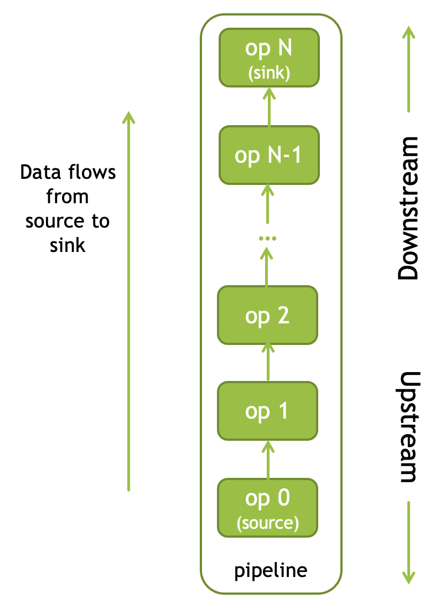
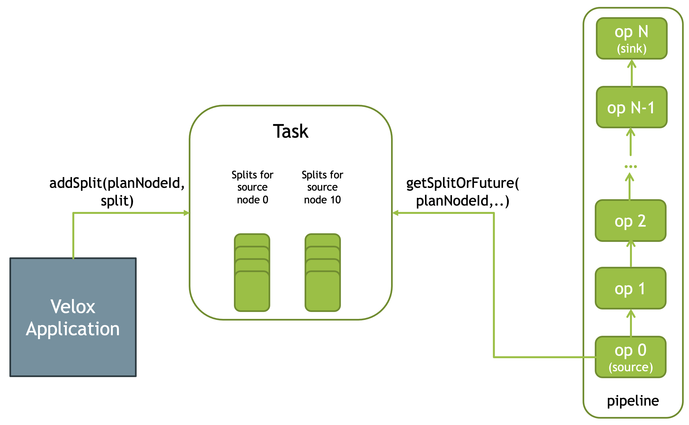
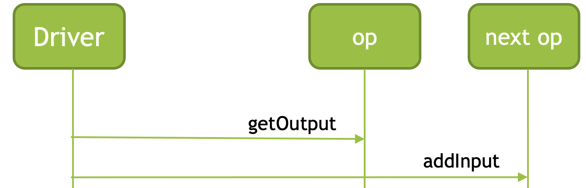
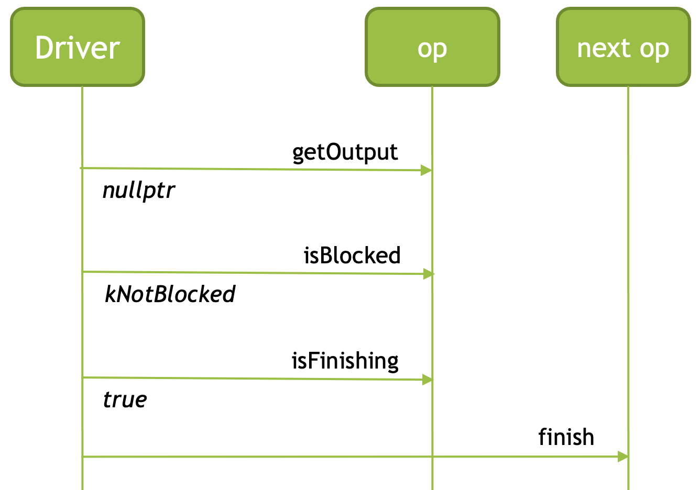

===========
Driver Loop
===========

Velox query plan is a tree of PlanNodes. Each PlanNode has zero or more child
PlanNodes. To execute a query plan, Velox converts it into a set of pipelines.
Each pipeline is made of a linear sequence of operators that corresponds to a
linear sub-tree of the plan. The plan tree is broken down into a set of linear
sub-trees by disconnecting all but one child node from each node that has two
or more children.

There is a special plan node, LocalPartitionNode, which also causes the plan
tree to be broken up into two sub-trees: the branch coming into the node and
the branch coming out of the node. This allows the parallelism of the pipeline.
This topic deserves a separate discussion though and it is out of scope for
this article.

Driver is responsible for executing a pipeline. The data flows from the source
operator at the bottom of the pipeline to the sink operator at the top of the
pipeline. Source operator is upstream. Sink operator is downstream.

Source operator receives input data by processing splits. A split contains
instructions on how to get data. It may contain a path of a data file to read
or a URL to download the data from. Each split is associated with a particular
source plan node. There can be multiple splits for a given source node. Velox
application is responsible for adding splits to the Task. Source operators are
fetching splits for the corresponding source plan nodes from the Task.

Splits are distributed on a first come first serve basis. When Velox runs
multiple instances of a pipeline in parallel, multiple source operators are
fetching splits for the same source node. Each source operator fetches a split,
processes it to produce output for the next operator in the pipeline, then
fetches the next split. Some operators may process more splits than the
others.

Non-source operators receive their input data from the upstream operators.

To run multiple instances of a pipeline in parallel, Task creates multiple
instances of the Driver. For each Driver, Task creates new instances of the
operators. A given operator instance is only used in a single Driver.

Driver interacts with operators using the Operator interface.

.. code-block:: c++

      // Returns true if ‘this’ can accept input. Not used if operator is a source
      // operator, e.g. the first operator in the pipeline.
      bool needsInput() const;

      // Adds input. Not used if operator is a source operator, e.g. the first
      // operator in the pipeline.
      void addInput(RowVectorPtr input);

      // Returns a RowVector with the result columns. If nullptr is returned the operator is
      // in one of three states:
      //   1. isBlocked != kNotBlocked: wait until the future is invoked, then call getOutput()
      //   2. isFinishing() == true: no more output will be produced
      //   3. needsInput() == true: call addInput(), then call getOutput()
      // The sink operator, i.e. the last operator in the pipeline, must return
      // nullptr (and be !isFinishing()) and pass results to the consumer through a
      // custom mechanism.
      RowVectorPtr getOutput();

      // Informs 'this' that addInput will no longer be called. This means
      // that any partial state kept by 'this' should be returned by
      // the next call(s) to getOutput. isFinishing must return true after this
      // call.
      void finish();

      // Returns kNotBlocked if 'this' is not prevented from
      // advancing. Otherwise, returns a reason and sets 'future' to a
      // future that will be realized when the reason is no longer present.
      // The caller must wait for the `future` to complete before making
      // another call.
      BlockingReason isBlocked(ContinueFuture* future);

      // Return true if finish() has been called or the operator doesn't need to
      // receive remaining input to produce the final result. Limit is one operator that
      // can finish before seeing all input. HashProbe is another example where it
      // finishes early if the build side is empty.
      bool isFinishing();

      // Frees all resources associated with 'this'. No other methods
      // should be called after this.
      void close();

The Driver fetches data from the upstream operator using getOutput() method and
adds it to the downstream operator using addInput() method.

When Driver encounters a blocked operator it goes off thread and resumes
operation only after the Future supplied by the operator completes.

There are multiple reasons for operators to be blocked. A source operator can be
blocked if there are no splits to process. The application might be slow to add
the splits to Task for example. A HashProbe operator may be blocked waiting for
the HashBuild operator to finish assembling a hash table. A sink operator may
be blocked because the consumer of pipeline results is fetching them slowly.

Before adding input, the Driver checks if the operator is ready to receive input
by calling needsInput() method. The operator may not need input if it hasn’t
yet fully processed the input received earlier. For example, a cross join
produces multiple batches of output for a single batch of input. This operator
needs to produce all the output batches before it can accept the next batch of
input.

The Driver runs a loop. On each iteration, it goes upstream to the first
operator that can produce data and adds it to the immediate downstream
operator. A given operator experiences the following sequence of events:

* needsInput() returns true
* addInput() provides new data
* getOutput() is called repeatedly until all results generated from the new input are
  returned. The operator returns nullptr when there are no more results.
* Steps 1-3 are repeated.

The Driver recognizes the following states of an operator:

* **Blocked** - Driver goes off thread and resumes operation when blocking future completes.
* **Needs input** - Driver goes upstream to find an operator that can produce data.
* **Produces output** - This state is indicated by getOutput() returning non-null vectors.
  Driver keeps calling getOutput() to fetch the results and push them downstream.
* **Finishing** - The Driver works on fetching all remaining output via repeated calls to
  getOutput() and pushing the data downstream.
* **Finished** - This state is indicated by not being blocked, not needing input and returning
  null from getOutput().

When an operator returns nullptr from getOutput(), the Driver checks if the
operator is blocked and if not whether it is finishing. If so, Driver considers
the operator finished and calls finish() on the immediate downstream operator
to signal that no more input is coming.

Typically, the operator will set the isFinishing flag to true when it receives a
call to finish(). However, an operator may set this flag earlier and
effectively cut pipeline short if it doesn’t need the remaining input to
produce the complete result. An example would be the Limit operator that sets
isFinishing to true after receiving the specified number of input rows. Another
example is the HashProbe operator that finishes early if the build side
produces an empty hash table. In these cases the Driver effectively abandons
the upstream operators and only calls close() on them after the remaining
downstream operators complete.

It is worth noting that source and sink operators are a bit different from the
intermediate operators. The driver never calls needsInput or addInput on the
source operator and the sink operator is expected to always return nullptr from
the getOutput() method. The sink operator indicates completion by not being
blocked and not needing input, e.g. returning kNotBlocked from isBlocked() and
false from needsInput().

An example of a source operator is TableScan operator. This operator uses
connectors to do the actual work of reading the data from the data source,
possibly applying a filter, and converting the results to Velox vectors.
TableScan operator fetches splits from the tasks and passes them to the
connector. The connector is responsible for interpreting the information
specified in the split. Hive connector expects the split to specify a path to a
DWRF or Parquet file, and a section of the file to process.

An example of a sink operator is the PartitionedOutput operator. This operator
partitions input data using the hash of the specified columns into a specified
number of partitions and enqueues the partitioned data into
PartitionedOutputBufferManager. Velox application can then fetch the
partitioned data from the PartitionedOutputBufferManager and send it to
downstream workers over the network or write it to files from which downstream
workers can read.

Another example of a sink operator is CallbackSink operator. This operator is
added to the pipeline if the application specifies a function to receive
results when creating a Task. This function receives a vector of results and
can block the pipeline by returning a blocking reason other than kNotBlocked
and setting a future.

.. code-block:: c++

    BlockingReason(RowVectorPtr result, ContinueFuture* future);

The Driver accumulates the following execution statistics for individual operators:

* blockedWallNanos - Total wall time spent waiting for the blocking future
    received from the operator to complete.
* addInputTiming - Total CPU and wall time spent in addInput() calls.
* getOutputTiming - Total CPU and wall time spent in getOutput() calls.
* finishTiming - Total CPU and wall time spent in getOutput() calls.
* inputPositions - Total number of input rows the operator received.
* inputBytes - Total number of input bytes the operator received.
* outputPositions - Total number of output rows the operator produced.
* outputBytes - Total number of output bytes the operator produced.

These statistics are included in the TaskStats available via Task::taskStats() API.
