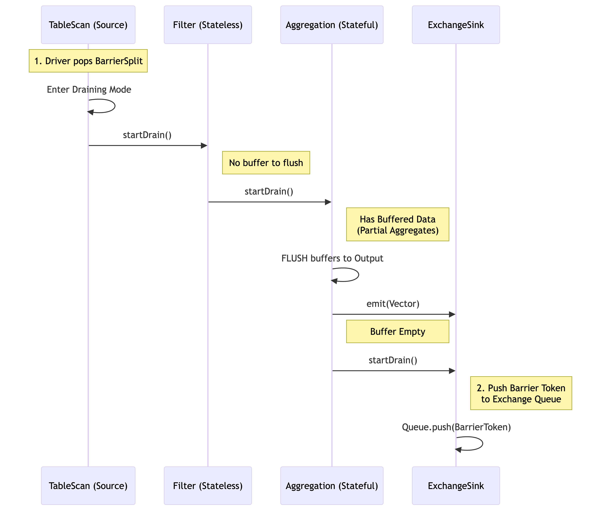
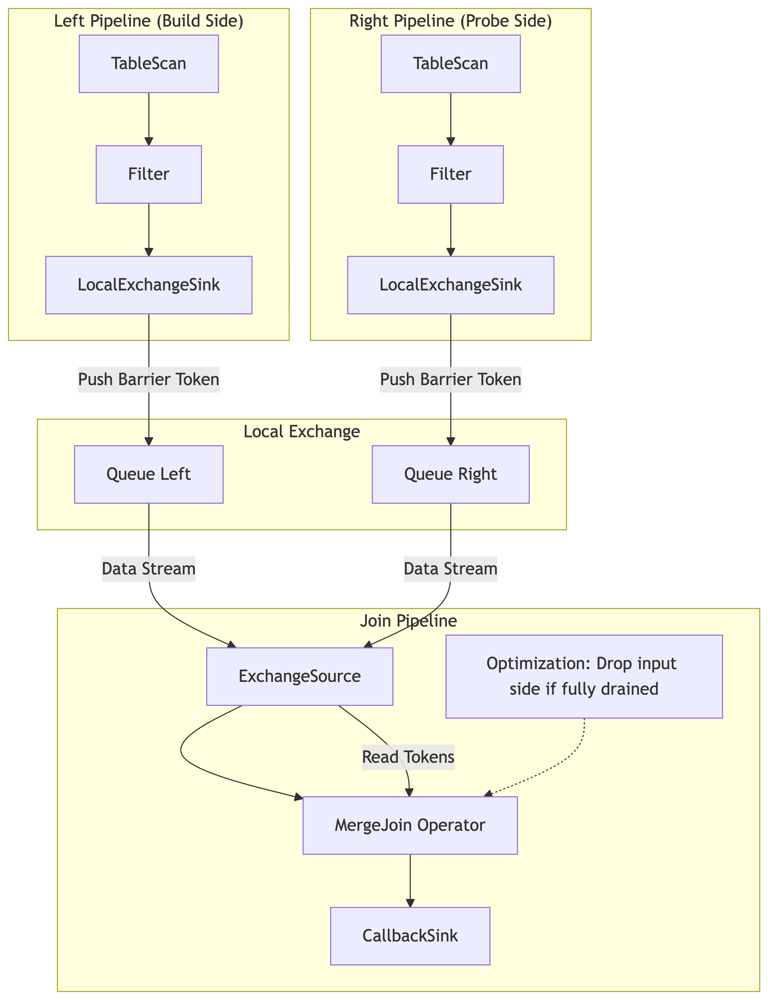

============
Task Barrier
============

Motivation & Context
--------------------

The introduction of Task Barrier support in Velox was driven by two distinct but
related high-performance workloads: AI training data loading and Real-time
Streaming Processing. Both require strict control over task lifecycle and state
management.

These workloads share three critical requirements:

1. **High Efficiency (Task Reuse)**: AI training feeds data split-by-split.
   Creating a new VeloxTask for every single split incurs some overhead (memory
   allocation, plan optimization, operator initialization).

2. **Checkpointing & Consistency (Streaming)**: Streaming systems need a way to
   safely "pause" the stream to take a consistent snapshot. To do this, the
   system must ensure all data belonging to a specific time window or epoch is
   fully processed and flushed before moving to the next.

3. **Deterministic Execution**: To ensure experiments are reproducible, data
   order and processing must be identical across runs.

The Solution: Task Barrier
--------------------------

To solve this, Velox uses Sequential Task Execution combined with a Task
Barrier. This allows a single Velox Task to be reused indefinitely.

The "Barrier" is a synchronization mechanism that forces the task to "pause"
and drain all in-flight data—including buffered data in stateful operators.

* **For AI Loading**: This ensures the task is clean and ready for the next
  batch of splits without overhead.

* **For Streaming**: This acts as a "consistent cut," ensuring that all state
  modifications for the current epoch are finalized and emitted before the next
  epoch begins.

API & Usage
-----------

The core API introduced is ``Task::requestBarrier()``. This signals the task to
finish processing all currently queued splits and fully drain all stateful
operators.

Workflow
^^^^^^^^

1. **Feed Splits**: The application adds a set of splits to the task, providing
   exactly one split per each data source (e.g., one file split for every
   TableScan node).

2. **Request Barrier**: Immediately after feeding the splits, the application
   calls ``requestBarrier()``. This signals that no more splits will be added
   after this Split Set until it has been fully processed, all resulting data
   has been produced, and the task has completely drained and signaled its
   completion (reached the barrier).

3. **Process & Barrier Detection**: The application continuously calls
   ``task->next()`` to fetch results. From a user perspective, the Barrier
   Reached state is detected precisely when:

   * ``task->next()`` returns no data (nullptr), AND
   * The returned ContinueFuture is not set (invalid)

   This specific combination confirms that the task is not merely blocked
   waiting for I/O, but has fully drained all vectors from the current Split
   Set and is now idle.

   (Note: The internal mechanism of how drivers coordinate this draining
   sequence and signal completion to the Task is explained in detail in the
   Implementation Mechanism section).

4. **Decision (Cycle or Finish)**: Once the barrier is reached, the application
   must take one of two actions:

   * **Finish Task**: If there are no more splits to process (e.g., end of
     dataset), call ``noMoreSplits()`` on the task to signal the final end of
     the job and terminate.
   * **Repeat Cycle**: If more splits exist, proceed to Step 5 to add the next
     set.

5. **Resume**: The application adds the new Split Set and repeats the process
   from Step 1.

Code Example (C++)
^^^^^^^^^^^^^^^^^^

The following pseudo-code illustrates how an AI data loader interacts with the
Velox Task Barrier:

.. code-block:: c++

    // AI data loading loop
    // 1. Get splits from the runtime
    // 2. Feed them to Velox
    // 3. Wait for barrier to ensure all data for those splits is produced

    bool addSplits();

    for (;;) {
      // Data consumption loop
      while (true) {
        ContinueFuture dataFuture = ContinueFuture::makeEmpty();
        // Fetch next batch of results (velox vector)
        auto data = veloxTask->next(&dataFuture);

        if (data != nullptr) {
          // Consume the data (e.g., feed to training loop)
          consume(data);
          continue;
        }

        // If no data is returned, check if we are blocked
        // BARRIER REACHED CONDITION: Data is null AND future is invalid.
        if (!dataFuture.valid()) {
          // The Task is now idle at the Barrier.

          // Attempt to fetch new splits for the next Split Set
          if (getSplits()) {
            continue; // New splits added -> Resume processing (Repeat Cycle)
          }

          // No more splits available -> Execution finished.
          return;
        }

        // Wait for the task to produce more data
        wait(dataFuture);
      }
    }

    // Helper to add splits and request barrier
    bool getSplits() {
      auto splitSet = nextSplitSet();

      // TERMINATION CONDITION:
      // If no more splits are available from the source (e.g., end of dataset),
      // we must explicitly signal the Task that input is finished.
      if (!splitSet.has_value()) {
         for (auto& [op, planNode] : veloxPlan.leafNodes) {
           veloxTask->noMoreSplits(planNode->id());
         }
         return false;
      }

      // Add splits for all leaf nodes
      for (auto& [op, planNode] : veloxPlan.leafNodes) {
        veloxTask->addSplit(planNode->id(), splitSet.at(planNode->id()));
      }

      // Request a barrier immediately after adding the split set
      // This acts as a seal for the current split set, ensuring the task
      // drains fully.
      veloxTask->requestBarrier();
      return true;
    }

Implementation Mechanism
------------------------

The implementation relies on a special Barrier Split and a cooperative draining
mechanism within the Driver pipeline.

The Barrier Split
^^^^^^^^^^^^^^^^^

When ``requestBarrier()`` is called:

* Velox injects a special "Barrier Split" into the split queue of every source
  operator in the leaf drivers (the drivers that read raw input splits).
* This split acts as a Sentinel that flows through the pipeline.
* It is excluded from standard task split processing statistics.

Draining Stateful Operators
^^^^^^^^^^^^^^^^^^^^^^^^^^^

Standard stateless operators (e.g., Filter, Project) process data
vector-by-vector, typically producing one output vector for each input vector
without buffering. They handle the barrier sentinel simply by passing it
downstream once the current input vector is finished.

However, stateful operators (like Aggregations or Joins) actively buffer data
across multiple input vectors. The barrier mechanism forces them to flush this
buffer via a BarrierState maintained by each Driver.

The Draining Process:

* **Trigger**: When a source operator receives the Barrier Split, it enters
  "draining mode" by calling the driver's ``drainOutput()`` method.
* **Action**: The driver then propagates this state by calling ``startDrain()``
  on the next operator in the pipeline.
* **Flush**: If that operator is stateful, it flushes all buffered data to the
  output.
* **Forward**: The operator then calls ``startDrain()`` on its downstream
  operator, ensuring the signal flows operator-by-operator within the driver.

Diagram: Draining Flow (Single Driver)
^^^^^^^^^^^^^^^^^^^^^^^^^^^^^^^^^^^^^^

The diagram below shows how the signal flows. Notice how the Stateful Operator
must flush its buffer before passing the signal to the Sink.

Cross-Pipeline Propagation (The DAG)
^^^^^^^^^^^^^^^^^^^^^^^^^^^^^^^^^^^^

A complex query plan in Velox is executed as a Directed Acyclic Graph (DAG) of
pipelines. The barrier must propagate through this entire graph in topological
order.

**Mechanism: LocalExchange via Exchange Queue**

The pipelines in Velox are connected by LocalExchange through an Exchange Queue
mechanism. This structure allows the barrier signal to "jump" across pipeline
boundaries.

* **Leaf Pipeline Completion**: The barrier processing starts at the leaf
  drivers. The signal propagates down the operators until it reaches the Sink
  Operator (e.g., LocalPartition, LocalExchangeSink).

* **The Bridge (Queue)**: When the Sink Operator receives the ``startDrain()``
  signal, it first flushes any buffered data it holds. It then places a special
  Barrier Token into the connecting Exchange Queue. This marker sits
  immediately after the last data vector generated by the current Split Set.

* **Downstream Pipeline Activation**: The downstream driver (e.g., the Join
  pipeline) reads from this queue. When its Source Operator encounters the
  Barrier Token, it interprets this as the signal to initiate the barrier
  sequence for its own pipeline.

* **Synchronization**: This ensures strict ordering. Pipeline B cannot finish
  its barrier processing until Pipeline A has fully flushed its data and passed
  the barrier token. The Task monitors the completion of all drivers via the
  internal ``finishDriverBarrier()`` mechanism; only when the final sink in the
  final pipeline has finished draining is the Barrier Future fulfilled.

Illustration: MergeJoin Example
^^^^^^^^^^^^^^^^^^^^^^^^^^^^^^^

Consider a MergeJoin with two upstream pipelines (Left and Right) feeding into a
Join pipeline.

* **Step 1**: The Task injects Barrier Splits into the TableScan operators of
  both the Left and Right pipelines.
* **Step 2**: Both pipelines process their splits, flush their local operators
  (e.g., filters), and push data to their respective Exchange Queues.
* **Step 3**: Both pipelines finish by pushing a Barrier Token into their
  queues.
* **Step 4**: The Join Pipeline reads from these queues. It processes data until
  it hits the Barrier Token on both inputs.
* **Step 5**: The MergeJoin operator receives ``startDrain()``. It performs the
  "Drop-Input" optimization (checking if it can stop early) and flushes any
  remaining matches.
* **Step 6**: The Join pipeline completes, fulfilling the user's promise.

TableScan & Source Operator Mechanics
-------------------------------------

The TableScan (or any Source Operator) is the entry point for the barrier
signal. Its behavior is critical for determining when to "Pause" (Drain) and
when to "Resume."

Delivery (Entering the Barrier)
^^^^^^^^^^^^^^^^^^^^^^^^^^^^^^^

* **Injection**: The ``requestBarrier`` API directly injects a BarrierSplit into
  the Task's split queue. This split is distinct from regular data splits (e.g.,
  FileSplit).
* **Detection**: The Driver loop responsible for the TableScan fetches the next
  split from the queue. When it pops the BarrierSplit, it does not attempt to
  read data.
* **Signal Initiation**: Instead of calling getOutput, the driver invokes
  ``startDrain()`` on the TableScan operator. This initiates the cascading drain
  sequence described in The Draining Process Section.
* **Exclusion**: The TableScan ensures this split does not increment task
  progress counters (e.g., "completed splits"), ensuring the barrier is
  transparent to execution metrics.

Resuming (Exit & Next Split)
^^^^^^^^^^^^^^^^^^^^^^^^^^^^

* **Idle State**: Once the TableScan has propagated the drain signal and the
  downstream pipeline has fully drained, the Driver completes that specific
  execution cycle. The Task marks the barrier future as complete.
* **Wait**: The TableScan driver does not terminate; it simply returns to
  checking the split queue. If the queue is empty, the driver yields (waits).
* **Re-activation**: When the application calls ``addSplit()`` with new data
  splits for the next logical Split Set:

  1. The splits are pushed to the queue.
  2. The TableScan driver wakes up, pops a valid data split, and resumes
     standard data processing (getOutput).

This seamless transition allows the same Task and Driver instances—and their
associated memory pools and caches—to be reused indefinitely.

Operator-Specific Implementation Details
----------------------------------------

The core of the barrier implementation lies in the ``startDrain()`` virtual
method. While stateless operators simply pass the signal through, stateful
operators must actively manage their buffers to ensure data determinism.

Index Lookup Join
^^^^^^^^^^^^^^^^^

* **Function**: Connects a stream of input rows (probe side) with a remote or
  local index (build side), often fetching matches asynchronously.

**Draining Complexity**: The operator typically buffers input rows to perform
batched lookups or asynchronous prefetches. Simply stopping input isn't enough;
pending lookups inside the execution engine must complete and be emitted.

**Barrier Logic**:

* **Flush Prefetch Buffers**: When the barrier signal is received, the operator
  forces the flushing of any "in-flight" batches that have been sent for lookup
  but haven't yet produced output.
* **Drain Output**: It ensures that ``getOutput()`` continues to return results
  until all buffered lookup requests have been resolved and emitted.

Unnest
^^^^^^

* **Function**: Expands complex types (arrays, maps) into multiple rows.

**Draining Complexity**: An Unnest operator might require multiple calls to
``getOutput()`` to fully process a single large input vector due to output batch
size limits. If a barrier arrives, the operator cannot simply stop; it must
finish expanding the current vector.

**Barrier Logic**:

* **Process Remaining Rows**: The ``startDrain()`` logic ensures that the
  operator does not accept new input vectors but continues to generate output
  until the current input vector is fully unnested.
* **Clean State**: Once the current input vector is exhausted, the operator
  transitions to a finished state for that specific barrier cycle, ensuring no
  partial arrays are left "half-expanded" across the split boundary.

Sort Merge Join
^^^^^^^^^^^^^^^

* **Function**: Assumes both inputs are sorted and finds matches by traversing
  them simultaneously. It is highly stateful and relies on the relative order of
  keys.

**Draining Complexity**: "Over-Reading" in Draining Mode

In a standard Sort Merge Join, the operator buffers rows from one side while
iterating through the other. When a Barrier acts as a temporary "End of Stream,"
the operator might continue reading from one input even after the other input
has finished, to find potential matches. However, because the inputs are sorted,
the operator often knows that no further matches are possible, making this extra
I/O wasteful.

**Barrier Logic & The "Drop-Input" Optimization**

This operator implements an optimization to prevent wasteful processing:

1. **Draining Matches**: When ``startDrain()`` is invoked, the operator forces
   the processing of any matches currently possible with the buffered data.

2. **Early Cutoff (Drop-Input)**:

   * **Logic**: If one side of the join is fully processed/drained (hit the
     barrier), the operator compares the max key from that finished side against
     the current key of the active side.
   * **Decision**: If the active side's key has already passed the finished
     side's max key (based on sort order), no future matches are possible.
   * **Action**: The operator sets the ``dropInputOpId`` in the BarrierState.
     This signals the driver to stop pulling data for the remaining side
     immediately.

This optimization saves significant CPU and I/O resources while still
guaranteeing the same correct result as a full drain.

Streaming Aggregation
^^^^^^^^^^^^^^^^^^^^^

* **Function**: Computes aggregates (SUM, COUNT, etc.) on data already sorted by
  grouping keys.

**Draining Complexity**: The operator buffers the current group's accumulation
in memory. If the split ends exactly at a barrier, that partial accumulation
exists in the operator's state but hasn't been emitted because the operator
hasn't seen a "new" key to trigger the flush.

**Barrier Logic**:

* **Force Group Flush**: Upon receiving the barrier signal via ``startDrain()``,
  the operator treats the event as a virtual "end of stream" for the current
  batch. It forces the emission of the accumulated result for the current group
  key, even if the key hasn't changed yet.
* **Reset Accumulators**: After flushing, the accumulators are reset. This
  ensures that when the task resumes after the barrier with new splits, it
  starts fresh.

Limitations
-----------

* **Sequential Execution Mode Only**: The barrier logic currently requires the
  task to be running in sequential execution mode (single-threaded logic per
  driver).

* **Restricted Data Sources**: The barrier execution strictly supports only
  TableScan source nodes. Other source nodes, such as Values (value source node)
  or RemoteExchange (remote exchange node), are not supported.

* **HashJoin**: Not supported. HashJoin involves complex build-side state
  management that is less common in the streaming/AI workloads targeted by this
  feature. These workloads typically rely on MergeJoin or IndexJoin to maintain
  order and lower memory footprint.
