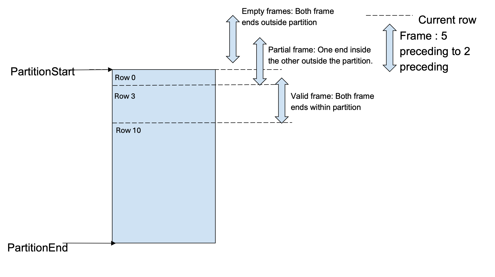

========================
Window Operator
========================

Velox supports window function evaluation using Window operator. In this guide
we will discuss some intricate design issues in this operator.

Window frames
-------------
Window functions can optionally include a FRAME clause. The FRAME clause
can be thought of as a spec for a sliding window of rows which bound
the window function computation for the given row.

Not all window functions are bound by the FRAME clause.

- Aggregates computed as window functions and value functions :func:`first_value`,
  :func:`last_value` and :func:`nth_value` honor window frames.
- Rank functions :func:`row_number`, :func:`rank`, :func:`dense_rank`,
  :func:`percent_rank`, :func:`ntile`, :func:`cume_dist` and value functions
  :func:`lead` and :func:`lag` are not affected by window frames.

A frame can be ROWS type or RANGE type, and it runs from frame_start to
frame_end. A FRAME clause is one of

.. code-block::

   {RANGE|ROWS} frame_start
   {RANGE|ROWS} BETWEEN frame_start AND frame_end

frame_start and frame_end can be any of:

.. code-block::

   UNBOUNDED PRECEDING
   expression PRECEDING
   CURRENT ROW
   expression FOLLOWING
   UNBOUNDED FOLLOWING

**ROWS mode**

ROWS mode can be interpreted as indices of the rows in the order in which they
appear in the window partition. This ordering is determined by the ORDER BY
clause. In ROWS mode, CURRENT ROW refers to the present row at which the
function is being evaluated. Each consecutive row has increasing frame number.
The frame numbers increase by 1 for each row.

**RANGE mode**

In RANGE mode, all peer rows have the same frame number.
Rows are peers if they have the same values for the ORDER BY field.
A frame start of CURRENT ROW refers to the first peer row of the current row,
while a frame end of CURRENT ROW refers to the last peer row of the current row.
If no ORDER BY is specified, all rows are considered peers of the current row.

**Misc**

UNBOUNDED PRECEDING and UNBOUNDED FOLLOWING always refer to the first and
last rows of the partition in either mode.

Window frame indices
--------------------

As window functions are evaluated for each row, the Window operator provides
each function a buffer of frame_start and frame_end indices at each
WindowFunction::apply call.

**Note**: Its possible during calculations that the frame indices are values
before or after the partition rows. In this case, the frame indices get bound
to the first and last rows of the partition.

As an example, for frame *ROWS BETWEEEN 2 PRECEDING AND 2 FOLLOWING*, the
frame indices will be as follows:

.. code-block::

  row_index    partition_col        order_by_col        frame_start         frame_end
       0            1                     1                   0                 2
       1            1                     2                   0                 3
       2            1                     2                   0                 4
       3            1                     3                   1                 5
       4            1                     4                   2                 6
       5            1                     4                   3                 7
       6            1                     4                   4                 7
       7            1                     5                   5                 7

On the other hand, for frame *RANGE BETWEEEN 2 PRECEDING AND 2 FOLLOWING*,
the frame indices will be as follows

.. code-block::

  row_index    partition_col        order_by_col        frame_start         frame_end
       0            1                     1                   0                 3
       1            1                     2                   0                 6
       2            1                     2                   0                 6
       3            1                     3                   0                 7
       4            1                     4                   1                 7
       5            1                     4                   1                 7
       6            1                     4                   1                 7
       7            1                     5                   3                 7

Empty frames
------------

Its possible that certain rows have empty frames. Empty frames occur when :

* Both frameStart and frameEnds fall before the first partition row.

  E.g. in frame *ROWS BETWEEN 5 PRECEDING and 2 PRECEDING* the first 2 rows
  have both frame ends before the first partition row.

* Both frameStart and frameEnds fall after the partition end row.

  E.g. in frame *ROWS BETWEEN 2 FOLLOWING and 5 FOLLOWING* the last 2 rows
  have both frame ends beyond the last partition row.

* frameStart > frameEnds row (as frame range is defined from frameStart to
  frameEnds).

  E.g. In frame *ROWS BETWEEN UNBOUNDED PRECEDING AND 2 PRECEDING* the intent
  is to compute aggregation from the partition start row to 2 rows prior
  the current one. However, for the first 2 rows the frameStart
  (frame index 0 for unbounded preceding) is ahead of 2 preceding
  (indices -2 and -1).

* For frames like *ROWS BETWEEN 2 PRECEDING AND 5 PRECEDING* or
  *ROWS BETWEEN 5 FOLLOWING AND 2 FOLLOWING*, frameStart > frameEnds for
  all rows. So all frames are empty.

**Partial frames**

Like illustrated in the examples above, rows could have partial window frames.
A partial frame occurs when:

- frameStart < frameEnd (so the empty frame condition is not violated)
- One frame end is within partition bounds and the other end outside of it.
  In these cases either frameStarts is before partitionStart while
  frameEnds within the partition, or frameStarts is in the partition but
  frameEnds beyond it.
For such frames the violating boundary is clamped to the partitionStart or
partitionEnd.

Partial frames usually follow empty frames in a sliding window.

E.g. In frame *ROWS BETWEEN 5 PRECEDING AND 2 PRECEDING*, the first 2 rows have both frameEnds
before partition start, so they are empty. But from 3rd - 5th row, the 5 preceding
bound (frameStarts) is outside the partition, but 2 preceding (frameEnds) is within the
partition. So for these 3 rows the frameStart is clamped to partitionStart.

Similarly for frame *ROWS BETWEEN 2 FOLLOWING AND 5 FOLLOWING*, the 3-5th rows
before partition end have the frameStart end within the partition,
but frameEnds beyond. So they are partial frames.
The last 2 rows have both ends outside the partition and are empty frames..

Empty and partial window frames can be visualized as below

Frames with constant frame bounds (like 2 preceding) have strict sliding behavior.
So the empty frames, partial frames and valid frames cluster together and follow
(or precede) each other. Adhoc frames that use column values for bounds can have
empty, partial or valid frames at any points in the partition rows.

**Handling empty frames in window functions**

As mentioned before, only value and aggregate window functions use frames in
their evaluation. Both Window functions return null values for empty frames.

The most naive approach to handle empty frames is to check in the window
function logic if the frame indices are an empty frame (based on the
conditions previously described) and return the null output.
This is very inefficient.

To aid the calculations, the Window operator computes a
*SelectivityVector* for the rows with valid frames in each
WindowFunction::apply(..) call. The function logic can
iterate over the rows with set bits in this SelectivityVector
for evaluations. The function sets NULL result values for the rows
with unset bits.

This SelectivityVector is passed in the validFrames argument in
the WindowFunction::apply() signature

.. code-block::

    virtual void apply(
       const BufferPtr& peerGroupStarts,
       const BufferPtr& peerGroupEnds,
       const BufferPtr& frameStarts,
       const BufferPtr& frameEnds,
       const SelectivityVector& validFrames,
       vector_size_t resultOffset,
       const VectorPtr& result) = 0;

The Window operator also clamps *partial* window frame indices to
the first or final partition row. So the Window function doesn't need
any special logic for partial frames.

